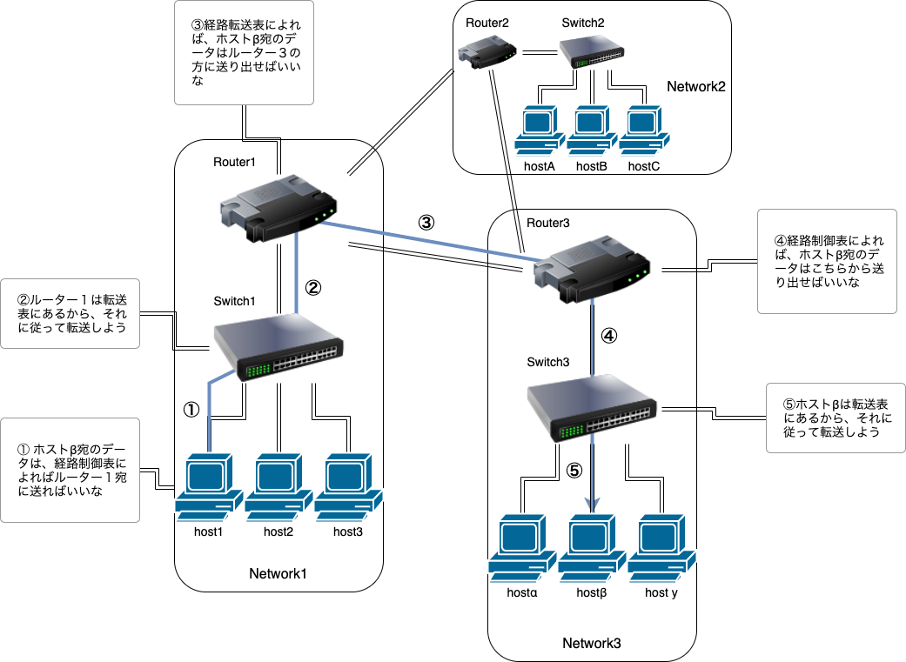
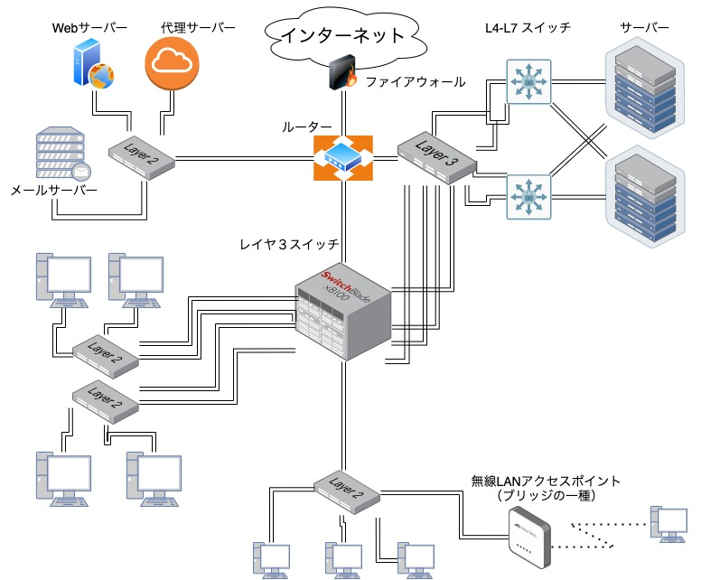
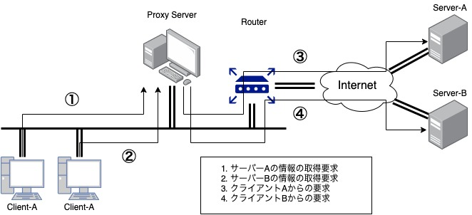

# マスタリング　TCP/IP　入門編　第５版

- 日本国内であればどこでも携帯電話などの情報端末を利用することにより、いろいろな情報をやり取りすることができる環境をネットワークと呼び、現在最も多く利用されている通信手段（プロトコル）が**TCP/IP**です
- TCP/IP登場以前のネットワークは、コンピュータを接続して情報交換を行なっていた
- が、今ではコンピュータに限らず、車やカメラ、家電製品などもTCP/IPで接続可能に
- しかし発展していくにつれ、複雑な構造のネットワークや、綿密な経路制御が必要になる
- 利用面の問題として、窃盗や詐欺を目的としたサイトの出現、データ改竄、情報漏洩など意図的な犯罪が発生している

## Chapter1 ネットワーク基礎知識

### コンピュータネットワーク登場の背景

#### コンピュータの普及と多様性

- 「２０世紀最大の発明はコンピュータであった」
- 大型汎用コンピュータ（メインフレーム）

#### スタンドアロンからネットワーク利用へ

- スタンドアロン（ネットワークに接続せず、単独で使用する状態）

- LAN（ネットワークの規模、１つの建物や大学のキャンパス）

- WAN（ネットワークの規模、離れた地域のLAN同士を接続）

#### コンピュータ通信から情報通信環境へ

- 初期のコンピュータネットワークは、特定のコンピュータ同士を接続したもので私的（プライベート）なネットワークだった
- 現在では会社内や組織内のコンピュータに限らず、インターネットに接続しているどのコンピュータとも通信できるようになる

#### コンピュータネットワークの役割

- 体のあらゆる情報が神経を伝わって脳に伝えられるように、コンピュータネットワークは人間の神経のような役割を果たします

### コンピュータとネットワーク発展の７つの段階

- コンピュータとネットワークの歴史

#### バッチ処理（Batch Processing）

- 処理するプログラムやデータなどを、まとめて一括で処理する方式
- 昔は、コンピュータは高価で巨大で、プログラムを実行するときには専用のオペレータに依頼する形態が取られていた

#### タイムシェアリングシステム（TSS）

- １台のコンピュータに複数の端末を接続し、複数のユーザが同時にコンピュータを利用できるようにしたシステム
- これによりインタラクティブ（対話的）な操作が可能に。
- BASIC（Beginner's All purpose Symbolic Instruction Code）というプログラミング言語も誕生した

#### コンピュータ間通信

- コンピュータ間を通信回線で接続してデータをやり取りするシステム
- 1970年代になると、コンピュータの性能も上がり、小型化も進み、価格も低くなる

#### コンピュータネットワークの登場

- 異なるメーカーのコンピュータ同士でも相互通信を可能にするコンピュータネットワークが登場する
- ウインドウシステムも登場する（コンピュータの画面上で複数の窓を開くことのできるシステム）
  - Unix マシン: X Window System
  - Microsoft: Windows
  - Apple: Mac OS X

#### インターネットの普及

- 1990年台初めには、ユーザがコンピュータを占有して使用できる環境もできる
- また、ダウンサイジングやマルチベンダ接続、インターネットメール（E-Mail）、WWW（World wide Web）、が普及し始めました
  - マルチベンダ（異種間接続）
  - ダウンサイジング（メインフレームからPCやUNIXワークステーションへ置き換えること）

#### インターネット技術中心の時代へ

- 電話網からIP網へ、そこから電話、テレビ放送、コンピュータ通信、インターネットが構築されるようになる
- コンピュータだけでなく携帯電話、家電製品、ゲーム機などありとあらゆるものがインターネットにつながるようになる

#### 「単につなぐ」時代から「安全につなぐ」時代へ

- 利便性が増すとともに、コンピュータウイルスの被害、企業情報や個人情報の漏洩、ネットワークを介した詐欺事件が出てくるようになる

|   年代   |                       内容                       |
| :------: | :----------------------------------------------: |
| 1950年代 |                 パッチ処理の時代                 |
| 1960年代 |         タイムシェアリングシステムの時代         |
| 1970年代 |             コンピュータ間通信の時代             |
| 1980年代 |         インターネットネットワークの時代         |
| 1990年代 |            インターネットの普及の時代            |
| 2000年代 |           インターネット技術中心の時代           |
| 2010年代 | いつでもどこでも何にでもTCP/IPネットワークの時代 |

#### 全ての鍵を握るTCP/IP

- コンピュータネットワークは人と人を結ぶ
  - コンピュータネットワークの目的は「生産性の向上」だが、「人と人を結ぶこと」もその目的の１つになっている

### プロトコルとは

#### プロトコルがいっぱい

| ネットワークアーキテクチャ |                 プロトコル                  |               主な用途                |
| :------------------------: | :-----------------------------------------: | :-----------------------------------: |
|           TCP/IP           | IP, ICMP, TCP, HTTP, TELNET, SNMP, SMTP ... |          インターネット、LAN          |
|      IPX/SPX(NetWare)      |              IPX, SPX, NPC ...              |              パソコンLAN              |
|         AppleTalk          |        DDP, RTMP, AEP, ATP, ZIP ...         |   現Apple社製品のLANで使われていた    |
|           DECnet           |              DPR, NSP, SCP ...              |  旧DEC社のミニコンなどで使われていた  |
|            OSI             | FTAM, MOTIS, VT, CMIS/CMIP, CLNP, CONP ...  |                                       |
|            XNS             |              IDP, SPP, PEP ...              | Xerox社ネットワークで主に使われていた |

- TCP/IPとはネットワークアーキテクチャのことである
- ネットワークアーキテクチャとはさまざまなプロトコルを体系的にまとめたものである

#### プロトコルが必要な理由

- プロトコルとはコンピュータ同士がネットワークを利用して通信するために決められた「約束事」である
- これによりメーカーやCPU、OSが違う機器同士でも、同じプロトコルを使えば通信することができる
- CPUとOS
  - CPU (Central Proccessing Unit) 「中央演算装置」とは、実際にプログラムを実行するコンピュータの心臓部である
  - OS (Operating System) 「基本ソフトウェア」とは、CPUやメモリの管理、周辺機器や実行プログラムの管理を行うプログラム（ソフトウェア）を集めたもの。

#### プロトコルを会話で考えると

- 日本語や英語を「プロトコル」、言語によってコミュニケーションをすることを「通信」、話の内容を「データ」として考えると、分かりやすい。

#### コンピュータでのプロトコル

- コンピュータは人とは違い、異例の事態に弱い。例えば、ルールがあればそれを変更や拡張したりできないし、障害で一部データが取得できなかった場合、そのデータがなければ先に進むこともできない

#### パケット交換でのプロトコル

- 大きなデータをパケット（Packet）と呼ばれる単位に分割して送信する方法

- 郵便のように、差出人と送り先の住所と、またいくつかのパケットに分けた場合はデータの順番が記載された番号を、通信回線に送り込みます

### プロトコルは誰が決める？

#### コンピュータ通信の登場から標準化へ

- 1974年IBM社は自社のコンピュータ通信技術を体系化したSNA(Systems Network Archhitecture)を発表
- しかし、会社独自のネットワークアーキテクチャは不便で、異なるメーカとは接続できない、メーカーのサポートが終わると全ての機器を買い替えなければいけなくなる

#### プロトコルの標準化

- ISO(Internetional Organization for Standardization)「国際標準化機構」は、国際標準としてOSI(Open Systems Interconnection)「開放型システム間相互接続」と呼ばれる通信体系を標準化
- インターネットで利用される機器やソフトウェアは、IETFによって標準化されたTCP/IPに準拠（基準に）しています

### プロトコルの階層化とOSI参照モデル

#### プロトコルの階層化

- OSI参照モデルとは、通信に必要な機能を７つの階層に分け、機能を分割することで、複雑にネットワークプロトコルを単純化するためのモデル
- 下位層から特定のサービスを受け、上位層に特定のサービスを提供する。上位層と下位層の間でサービスのやり取りをする時の約束事を「インターフェース」と呼び、通信相手の同じ階層とやり取りをする時の約束事を「プロトコル」と呼ぶ
- 一部のプロトコルを変更してもその影響がシステム全体に波及しないため、拡張性や柔軟性に富んだシステムを構築できる
- 欠点は、モジュール化を進め過ぎてしまうと処理が重くなる

#### 会話で階層化を考えると

省略

#### OSI参照モデル

- OSI参照モデルは最初に学ばなければならない登竜門的存在
- また、それはあくまで「モデル」であり、各層の大まかな役割を決めているだけで、プロトコルやインターフェースの詳細を決めるものではない

#### OSI参照モデルの各層の役割

### OSI参照モデルによる通信処理の例

- ホストはネットワークに接続されたコンピュータという意味

#### 7階層の通信

- 送信側では7, 6の順番で、受信側では1, 2の順番でデータが伝えられる
- 上位層から渡されたデータに自分の階層のプロトコル処理に必要な情報を「ヘッダ」という形でつける
- 受信側では、受信したデータを処理して「ヘッダ」と上位層への「データ」に分離する

#### セッション層以上での処理

- 電子メールでの通信例

##### アプリケーション層

- メールソフトの機能を細かく分類すると、通信に関わる部分と、データを入力する部分と２つに分類される
- その、「文章を入力した後にデータを送信する部分」がアプリケーション層に相当する
- アプリケーション固有のエラー処理も、アプリケーション層の役割
- ホストAがホストBにデータを送るとして、ホストAのアプリケーション層の役割はホストBのアプリケーション層と通信して、電子メールを格納するという最終的な処理まで行うこと。

##### プレゼンテーション層

- 「プレゼンテーション」とは表示とか「提示」という意味で、データの表現形式を意味する
- プレゼンテーション層の役割は、異機種間でもデータの表現形式の整合性をとること
- また、送信するデータを「コンピュータ固有の表現形式」から「ネットワーク全体で共通の表現形式」に変換、送信すること
- 例として、符号化方式がうまく設定できておらず、「文字化けする」のはプレゼンテーション層のせいである

##### セッション層

- セッション層の役割は、コネクションを確立/切断を効率よく行い、判断して制御することです
- その判断は渡されたデータについている「タグ」や「ヘッダ」を見て判断する

#### トランスポート層以下での処理

- これまでの処理では、アプリケーション層で書き込まれたデータが、プレゼンテーション層で符号化されて、セッション層でコネクションを確立するタイミングやデータを転送するタイミングの管理をしました
- ここからの処理は、実際にネットワークを使ってデータの送信処理を行います

##### トランスポート層

- トランスポート層の役割は、コネクションの確立や切断の処理を行い、ホスト間の論理的な通信手段を作ること
- また、コネクションの確立や切断をするタイミングを決めるのはセッション層である
- また、データがきちんと届かなかったデータを再送したりもする

##### ネットワーク層

- ネットワーク層の役割は、ネットワークとネットワークが接続された環境で、送信ホストから受信ホストまでデータを配達すること
- 実際にデータを送信するには、宛先の住所（アドレス）が必要。電話番号のようなもの
- ネットワーク層の上位層から渡されたデータに、アドレス情報などがつけられてデータリンク層に送られる

##### データリンク層、物理層

- データリンク層は、通信媒体で直接接続された機器同士でデータのやり取りをできるようにする役割がある

- 物理層では、データの0や1を電圧や光のパルスに変換して物理的な通信媒体に流し込む
- 直接接続された機器間でもアドレスが使用され、MAC(Media Access Control)アドレスまたは、物理アドレス、ハードウェアアドレスと呼ばれます。
- このアドレスは、同じ通信媒体に接続された機器を識別するためのアドレスで、このMACアドレスの情報を含むヘッダが、ネットワーク層から渡されたデータに付けられて実際のネットワークへ流される

### 通信方式の種類

#### コネクション型とコネクションレス型

- ネットワークでのデータの配送は、「コネクション型」と「コネクションレス型」の２つに分けることができる

##### コネクション型

- データの送信を開始する前に、送信ホストと受信ホストの間で回線を接続します

##### コネクションレス型

- 通信相手がいるかどうかの確認は行われない

#### 回線交換とパケット交換

##### 回線交換

- 回線交換は交換機がデータの中継処理を行う。コンピュータは交換機に接続され、交換機間は複数の通信回線で接続されている
- 通信する場合、交換機を通して目的のコンピュータとの間に回線を設定する。回線は占有利用
- 占有利用のデメリットは、交換機間の回線数よりも通信を希望するユーザーの数が多くなると通信ができなくなること

##### パケット交換

- パケット交換は回線に接続しているコンピュータが送信するデータを複数の小包に分け、転送の順番を待つ行列に並べる方法
- 1つの回線を複数のユーザで共有しても通信を行えるため、占有利用のデメリットを解消できる

- パケット交換では、パケット交換機（ルーター）によって通信回線が結ばれる
- ルーターの中にはバッファと呼ばれる記憶領域があり流れてきたパケットはこのバッファに一旦格納され、転送されます

#### 通信相手の数による通信方式の分類

##### ユニキャスト（Unicast）

- １を意味するUni、投げるを意味するCastを組み合わせて、1対1通信を意味する。**電話**

##### ブロードキャスト（Broadcast）

- 「放送」の意味のBroadでは1台のホストから接続されるすべてのホストに向けて情報を発信します。**テレビ放送**

##### マルチキャスト

- ブロードキャストと同様に複数のホストに向けて情報を発信するが、通信先を特定のグループに限定する。**ビデオ会議**

##### エニーキャスト（Anycast）

- 「どれでも」の意味のAnyは特定の複数台に向けて問いかけを行う仕組み。帰ってきたデータから最適な条件を選び通信する
- 例としてDNSのルートネームサーバーなどがある

### アドレスとは

- 電話の場合の電話番号。手紙の場合の住所氏名がそれにあたる

#### アドレスの唯一性

- 同じアドレスが複数あることを許さないこと。唯一性は「ユニーク」ともいう

- ユニキャストと違い、ブロードキャスト、マルチキャスト、エニーキャストは機器の集団を特定するアドレスなので、ユニークである

#### アドレスの階層性

- 階層性のあるアドレスはA-a-1やA-b-2などのようにあっており、 A -> A-b ->  A-b-2のように辿れる。IPアドレスはこのようなアドレス
- 階層性のないアドレスは上記のように階層がないので個々のアドレスから場所やグループを特定できない。MACアドレスはこのようなアドレス
- MACアドレスは、ネットワークインターフェースカード(NIC)ごとに製造者識別子と製造者内での製造番号、製品ごとの連番が付いており、唯一性が担保されている
- しかし、NIC(Network Interface Card)が世界中のどこで使われるかは特定できない。アドレスを探すときは役に立たない
- IPアドレスは、ネットワーク部とホスト部という2つの部分から構成されている
- ネットワーク部は、組織、プロバイダ、地域などで集約可能になっておりアドレスを探すのに適している
- ネットワークの途中にある通過点では、各パケットの宛先アドレスを見てどのネットワークインターフェースから送り出すか決める
- そのためにアドレスごとに送出インターフェースを記したテーブルを参照する。
- MACアドレスの場合は転送表（フォワーディングテーブル）、IPアドレスの場合は経路制御表（ルーティングテーブル）という

### ネットワークの構成要素

 

|             機器             |                           役割                           |
| :--------------------------: | :------------------------------------------------------: |
| ネットワークインターフェース |      コンピュータをネットワークに接続するための装置      |
|          リピーター          |            ネットワークを物理的で延長する装置            |
|  ブリッジ・レイヤ２スイッチ  |        ネットワークをデータリンク層で延長する装置        |
|  ルーター・レイヤ３スイッチ  |       ネットワーク層によってパケットを転送する装置       |
|      レイヤ4-7スイッチ       | トランスポート層より上の情報でトラフィックを処理する装置 |
|         ゲートウェイ         |                プロトコルの変換をする装置                |

#### 通信媒体とデータリンク

- 接続するケーブルの種類は、ツイストペアケーブル、光ファイバーケーブル、同軸ケーブル、シリアルケーブルなどがある
- データリンク（直接接続された機器間で通信するためのプロトコルやネットワーク）の種類によって、利用するケーブルが変わる

| データリンク名 | 通信媒体                                                   | 伝送速度                                      | LAN                   |
| :------------: | :--------------------------------------------------------- | --------------------------------------------- | :-------------------- |
|  イーサネット  | 同軸ケーブル ツイストケーブル 光ファイバケーブル | 10Mbps 10Mbps~10Gbps 10Mbps~100Gbps | LAN LAN LAN |
|      無線      | 電磁波                                                     | 数Mbps~                                       | LAN~WAN               |
|      ATM       | ツイストペアケーブル 光ファイバケーブル               | 25Mbps, 155Mbps 622Mbps                  | LAN~WAN               |
|      FDDI      | 光ファイバケーブル ツイストペアケーブル               | 100Mbps                                       | LAN~WAN               |
| フレームリレー | ツイストペアケーブル 光ファイバーケーブル             | 64k~1.5Mbps程度                               | WAN                   |
|      ISDN      | ツイストペアケーブル 光ファイバケーブル               | 64k~1.5Mbps                                   | WAN                   |

**伝送速度とスループット**

- データを送信するとき、2つの機器感を流れるデータの物理的な速さを伝送速度という。bpsで表される
- 道路を例にすると、低速なデータリンクは車線の数が少ないため一度にたくさんの車が通れない道といえる
- 帯域(Bandwidth)が広いほど高速なインターネットを意味する
- 実際にホスト間でやり取りされる転送速度をスループットという。bpsで表される
- こちらは帯域だけでなく、ホストのCPUやネットワークの混雑度、パケット中にデータが占める割合などを考慮した実効転送速度を意味する

**ネットワーク機器の相互接続**

- ネットワークを導入するときは、スペックだけでなく、相互接続性や運用実績も見て判断すると良い

#### ネットワークインターフェース

- ネットワークインターフェースは、NIC、ネットワークアダプタ、ネットワークカード、LANカードとも呼ばれる
- 最近では「LANポート内蔵」と書かれたイーサネット(Ethernet)の100BASE-Tや100BASE-TXのポートが初めから備えたコンピュータが多くなっている

#### リピーター

- リピーター(Repeater)は、OSI参照モデルの第１層の物理層でネットワークを延長する機器である
- ケーブル状を流れてきた電気や光の信号を受信し、増幅や波形の整形などをしたのちに別の側へ再生する機器である
- 通信媒体を変換できるリピーターもある

#### ブリッジ・レイヤ２スイッチ

- ブリッジは、OSI参照モデルのデータリンク層でネットワーク同士を接続する装置
- データリンクのフレームを認識してブリッジ内部のメモリに一旦蓄積し、接続された相手側のセグメントに新たなフレームとして送出する
- データリンクのフレームには、フレームが正しく届いたかどうかをチェックするためのFCS(Frame Check Sequence)と呼ばれるフィールドがあり、壊れたフレームを他のセグメントに送信しないようにする働きがある。
- ブリッジでは、アドレスの学習によって転送の有無を判断する機能があり、これはデータリンク荘に位置付けられる機能であり、このためレイヤ２スイッチ(L2スイッチ)と呼ばれることもある
- ブリッジによっては、パケットを隣のセグメントに流すかどうかの判断を行う機能を持つものもあり、ラーニングブリッジと呼ばれている
- 一度そのブリッジを通過したフレームのMACアドレスは、一定時間テーブルのメモリに記憶され、どのセグメントにどのMACアドレスを持つ機器があるか判断する仕組みになっている

#### ルーター・レイヤ３スイッチ

- ルーターは、OSI参照モデルのネットワーク層の処理を行う。ネットワークとネットワークを接続して、パケットを中継する装置
- ブリッジでは物理アドレスで処理をするが、ルーターはIPアドレスで処理する
- ルーターはイーサネットとイーサネット、イーサネットとFDDIのように異なるデータリンクを相互に接続することができる
- 家庭やオフィスをインターネットで接続するときにブロードバンドルーターが使われる

#### レイヤ4-7スイッチ

- レイヤ4-7スイッチは、トランスポート、セッション、プレゼンテーション、アプリケーション層の情報に基づいて配送処理を行う
- またWebサイトの負荷を抑えるためにWebサーバーの手前にロードバランサーというレイヤ4-7スイッチの一種を設置する場合もある
- 帯域制御（通信が混雑したときに優劣をつける）もレイヤ4-7スイッチの機能の一部
- 他にも、遠方の回線間でデータ転送を高速化する仕組み（WANアクセラレータ）、特定アプリケーションの高速化、インターネットを経由した外部からの不正アクセス防止の為のファイアウォールなど、用途に応じて利用される

#### ゲートウェイ

- OSI参照モデルの4-7層までの階層で、データを変換して中継する装置
- プレゼンテーション層やアプリケーション層を扱うゲートウェイが一般的
- インターネットの電子メールと、携帯電話の電子メールはプロトコルが違うため通信できないが、インターネットと携帯電話を接続している接点にゲートウェイがあり、解読、変換、中継をするので電子メールのやり取りが可能になる
- またWWW(World Wide Web)を使用するときに、ネットワークトラフィックの軽減やセキュリティを意図して代理サーバー（Proxy Server）を設定する場合があり、これもゲートウェイの一種であ理、アプリケーションゲートウェイと呼ぶ

### 現在のネットワークの姿

#### 実際のネットワークの構成

- コンピュータネットワークを道路で表すと、高速道路に相当するのが、「バックボーン」とか「コア」になる
- インターチェンジに相当するのが、「エッジ」と呼ばれています。多機能ルータ（情報の優位順位や種類による運びからの変更を制御する機能が備わっているルーター）や高速なレイヤ３スイッチが利用されている
- インターチェンジ付近の国道や県道が接続され市街地にアクセスできる部分を、コンピュータネットワークでエッジと接続されている部分を「アクセス」とか「アグリゲーション」と呼んでいます

**ネットワークの物理構成と論理構成**

- 道路の場合、渋滞を解消するために、工事をして車線を拡張したりバイパスを建設したりしなければいけない
- これはネットワークで言うと、通信ケーブルを増やすなど、物理層（物理構成）の拡張をすることに相当する。
- しかしネットワークにおける通信は、物理的な回線だけでなく、その上の層における論理的な回線で行われる（論理構成）。そのため必要に応じて道路の幅を「仮想的」に広げたり、制限したりできる

#### インターネット接続サービスを利用した通信

- 家庭や会社から外部のネットワークを利用するとき、インターネット接続サービスを利用する。通信は「アクセス」に接続され必要な場合は「エッジ」や「バックボーン」を経て通信相手に接続されます

#### 携帯電話による通信

- 携帯電話の電源を入れると自動的に電波が発進され最寄りの基地局と通信が行われる（端末が移動している場合、自動的に基地局間で情報が交換され引き継がれていく。ローミングという）
- 基地局には、契約しているモバイルオペレータの携帯電話用のアンテナが設置されている。その基地局が「アクセス」に相当する

**LTEと音声通話**

- 第三世代や第3.5世代の携帯電話ネットワークは、最大でも64kbpsの速度で転送される音声通話や、少量のデータ通信を念頭に設計されたもの
- LTEは第4世代携帯電話への橋渡しを担うものとして、3GPP(Third Generation Partnership Project)が策定している通信規格で、最大で下り300Mbps、上り75Mbpsの高速な無線通信が可能

#### 情報発信者側にとってのネットワーク

- かつては個人や企業が自分でサーバを用意し、そこでWebサイトを作成・公開していたが、現在はブログサービスやホスティングサービスを利用するケースが増えている
- データセンターは巨大なサーバーとストレージ、そしてネットワークから構成されている
- 内部ではレイヤ３スイッチや高速ルーターを利用したネットワークが構築されている。遅延を少なくするためレイヤ２スイッチの利用も検討されている

**仮想化とクラウド**

- 一部のWebサイトでは利用される日時や時間帯にムラがある。そこで登場したのが仮想化技術
- サーバー、ストレージ、ネットワークを物理的に増やすのではなく、ソフトウェアを使って論理的に必要なときに必要な量を提供する仕組み
- 仮想化技術を利用し使用者にとって必要な資源を自動的に提供する仕組みをクラウドという
- 仮想化されたシステム全体を必要に応じて自動的に制御する仕組みをオーケストレーション（orchestration）という
