## Chapter2 TCP/IP 基礎知識

### TCP/IP登場の背景とその歴史

- TCP/IPがなぜこれほど有名になったのか。その経緯をインターネット発達の歴史から考えていくことにしましょう

#### 軍事技術の応用から

- 1960年代、アメリカ国防総省（DoD: The Department of Defence）が中心となり進められた研究開発がありました
- それは、通信している途中でネットワークの一部が敵の攻撃によって破壊されても、迂回経路を通してデータが配送され、通信が停止しないネットワークを開発すること。
- パケット通信ならそれを実現できます。さらにそれを利用すれば、複数のユーザで同時に1つの回線を共有することができ、回線コストを下げることができる

#### ARPANETの誕生

- 1969年にパケット交換技術の実用性を試験するためのネットワークが構築されました
- これがARPANET（Advanced Research Projects Agency Network）と呼ばれるネットワークで、インターネットの起源と言われています
- この実験が成功し、パケットによるデータ通信手法が実用に耐えることが証明されたのです

#### TCP/IPの誕生

- ARPANET内の研究グループによって、1970年代前半にTCP/IPが開発されました。その後1982年ごろまでかかってTCP/IPの仕様が決定され1983年にはARPANETで使う唯一のプロトコルになりました

|      年      |                             内容                             |
| :----------: | :----------------------------------------------------------: |
| 1960年代後半 |       DoDによって通信技術に関する研究開発が開始される        |
|    1969年    |            ARPANETの誕生。パケット交換技術の開発             |
|    1972年    |           ARPANETの成功。５０ノード以上にまで拡大            |
|    1975年    |                         TCP/IPの誕生                         |
|    1982年    | TCP/IPの仕様決定。UNIXが提供され始める。このUNIXの中にはTCP/IPが実装されていた |
|    1983年    |               ARPANETの正式手順がTCP/IPに決定                |
|  1989年ごろ  |               LAN上でのTCP/IP利用が急速に拡大                |
|  1990年ごろ  |         LAN,WANを問わず、TCP/IPが使われる方向に発展          |
|  1995年ごろ  |  インターネットの商用化が進み、プロバイダが数多く設立される  |
|  1996年ごろ  | 次世代IPのIPv6の仕様が決定し、RFCに登録される。（1998年に修正される） |

#### UNIXの普及とインターネットの拡大

- 1980年代前後の大学や研究所などでは、コンピュータのOS(Operating System)としてBSD UNIX(カリフォルニア大学バークレー校で開発)が広く利用されていた
- 同じ年に、旧Sun Microsystems社が、TCP/IPを実装した製品を一般ユーザー向けに提供し始めました
- 1980年代は、LANが発達するとともに、UNIXワークステーションの普及が急速に進んだ時代でした。TCP/IPによる世界的なネットワークを「インターネット」と呼ぶようになったのはこの頃から
- インターネットは、終端ノード間のUNIXマシン同士を繋げる形で大きく普及していきました
- 1980年代半ばごろからは、企業などを中心に導入が進んでいた各コンピュータメーカー独自のプロトコルも、次第にTCP/IPに対応するようになる

#### 商用インターネットサービスの開始

- 1990年代になると、ISP（インターネットサービスプロバイダ）が登場し、同時にインターネットを利用した、オンラインゲームやSNS、動画配信などの商用サービスも始まる
- それまでも、電話回線を利用したパソコン通信（モデムを介して電話機で接続し、メール、掲示板などのサービスを利用した）など、一般の人々の間にもコンピュータ通信に対する需要は高まっていたが、限られた人しかコミュニケーションできない
- インターネットを利用すればWWWで全世界から情報を集めたり、電子メールでコミュニケーションを取ることができる

### TCP/IPの標準化

#### TCP/IPという語は何を指す

- TCP/IPという言葉は、IPを利用したり、IPで通信したりするときに必要となる多くのプロトコル群の総称として使われる
- 具体的には、IPやICMP、TCPやUDP、TELNETやHTTPなどが含まれる
- TCP/IP をプロトコルスイート（インターネットプロトコル一式、または一揃いという意味）ともいう

#### TCP/IP標準化の精神

- TCP/IPのプロトコルの標準化は、他と比べると、オープンであること、標準化するプロトコルが実際に使えるプロトコルであるかどうかを重視することが異なります
- TCP/IPのプロトコルの仕様を決めるときには実装することを念頭におきながら作業が進められていた
- そして、複数の実装を持ち寄って相互接続の実験が行われ、問題、修正を繰り返してプロトコルが標準化される
- TCP/IPと比べてOSIが一般に普及しなかったのは、動作するプロトコルを早く作れなかったこと、急速な技術革新に対応できるようなプロトコルの決定や改良を行える仕組みがなかったことが原因とされている

#### TCP/IPの仕様書RFC

- 標準化しようとするプロトコルは、RFC（Request For Comments）と呼ばれるドキュメントとなり、インターネット上で公開せれます
- 主要なプロトコルや標準に対してはSTD（Standard）という番号付けがされている。あとインターネットのユーザーや管理者のための有益な情報を提供するためにFYI（For Your Information）という番号づけもされている
- RFCは[rfc editor]( https://www.rfc-editor.org/search/rfc_search.php)で検索できる

#### TCP/IPプロトコルの標準化の流れ

- まず仕様を煮詰めるインターネットドラフトの段階があります。そして標準化した方が良い他認められるとRFCとなり、提案標準（Proposed Standard）になり、そして標準の草案であるドラフト標準（Draft Standard）になり、最後に標準（Standard）になります
- 標準化を目指さない実験用のプロトコルは、実験プロトコル（Experimental）として登録される

#### RFCの入手方法

- [RFC Editor](https://www.rfc-editor.org/)
  - STD: /in-notes/std/
  - FYI: /in-notes/fyi

### インターネットの基礎知識

#### インターネットとは

- 元々は複数のネットワークを結んで1つのネットワークにすることを表していましたが、現在ではARPANETから発展し、全世界を接続しているコンピュータネットワークのことを指す

#### インターネットとTCP/IPの関係

- インターネットのプロトコルといえばTCP/IP、TCP/IPといえばインターネットのプロトコルである

#### インターネットの構造

- 小さなネットワークが集まって組織内のネットワークに、組織内のネットワークが集まって地域ネットワークに、地域ネットワークが集まって最終的に世界中を結ぶ巨大なインターネットを形作っています。このように、インターネットは階層的な構造を持っている
- それぞれのネットワークは、バックボーン（基幹ネットワーク）と、スタブ（末端のネットワーク部分）から構成されている
- ネットワークとネットワークはNOC（Network Operation Center）で接続されます、また、ネットワークの運用者や運用方針、利用方針などが異なるネットワークを対等に接続するポイントはIX（Internet Exchange）と呼ぶ

#### ISPと地域ネット

- ISPでは、さまざまな接続メニュー（サービス品目）があり、月に数回数時間だけ、移動先からでも自由に利用可能、高速常時接続可能な契約など色々用意されている

### TCP/IPプロトコルの階層モデル

- ネットワークを導入する人、構築する人、管理する人、機器の設計や製造をする人、プログラミングをする人は、TCP/IPについて知識を持つことが大切

#### TCP/IPとOSI参照モデル

- OSI参照モデルは「通信プロトコルに必要な機能は何か」を中心に考えてモデル化されているのに対し、
- TCP/IPの階層モデルは「プロトコルをコンピュータに実装するにはどのようにプログラミングしたらよいか」を中心に考えてモデル化されている

#### ハードウェア（物理層）

- イーサネットや電話回線など。通信媒体はケーブル、無線など

#### ネットワークインターフェース層（データリンク層）

- イーサネットなどのデータリンクを利用して通信するためのインターフェースとなる階層（NICを動かすための「デバイスドライバ」）
- デバイスドライバはOSとハードウェアの橋渡しをするソフトウェア

#### インターネット層（ネットワーク層）

- インターネット層ではIPプロトコルが使われ、IPアドレスをもとにしてパケットを転送します

**IP（Internet Protocol）**

> ネットワークを跨いでパケットを配送し、インターネット全体にパケットを送り届けるためのプロトコル
>
> IPには、データリンクの特性を隠す役割もある。パケットの再送はしない

**ICMP（Internet Control Message Protocol）**

> IPパケットの配送中に何らかの異常が発生してパケットを転送できなくなった時にパケットの送信もとに異常を知らせるために使われるプロトコル
>
> ネットワーク診断などに使われる

**ARP（Adress Resolution Protocol）**

> パケットの送り先の物理的なアドレス（MACアドレス）をIPアドレスから取得するプロトコル

#### トランスポート層

- トランスポート層の役割はアプリケーションプログラム間の通信を実現すること
- アプリケーションプログラムの識別にはポート番号と呼ばれる識別子が使われます

**TCP/IP（Transmission Control Protocol）**

> TCPは、コネクション型で信頼性のあるトランスポート層のプロトコル。両端のホスト間でデータの到達性を保証する
>
> パケットがなくなったり、順番が入れ替わったりしてもTCPが解決します。
>
> ネットワークの帯域幅を有効に利用する仕組みや、ネットワークの混雑を和らげる仕組みなど、さまざまな機能が組み込まれている
>
> ただし、コネクションの確立・切断の制御にパケットを約7回やりとりをするので、ビデオ会議の音声・映像データなど
>
> 一定間隔で決められた量のデータを転送する通信には向いていない

UDP（User Datagram Protocol）

> UDPは、コネクションレス型で信頼性のないトランスポート層のプロトコル
>
> パケットがなくなったり、順番が入れ替わったりしても関係ない。相手のコンピュータがネットワークに接続されているかは、アプリケーションのプログラムが行う
>
> パケット数が少ない通信や、ブロードキャストやマルチキャストの通信、ビデオや音声などのマルチメディア通信に向いている

#### アプリケーション層（セッション層以上の上位層）

- TCP/IPのアプリケーションの多くは、クライアント・サーバーモデルで作られている。
- サービスを提供するサーバープログラムはあらかじめホスト上で動作させておき、クライアントからの要求がいつ来ても対応できるようにしておく

**WWW（World Wide Web）**

> WWWはインターネットが一般に普及する原動力となったアプリケーション。
>
> ブラウザとサーバー間の通信で使われるプロトコルがHTTP（HyperText Transfer Protocol）で、送信に使われる主なデータフォーマットが、HTML（HyperText Markup Language）です
>
> WWWではHTTPがOSI参照モデル参照のアプリケーションプロトコル、HTMLがプレゼンテーション層のプロトコルと言える

**電子メール（E-Mail）**

> 電子メールの配送にはSMTP（Simple Mail Transfer Protocol）というプロトコルが利用される
>
> 当初、インターネットの電子メールではテキスト形式でしかメッセージを送信できなかったが、MIME（Multipurpose Internet Mail Extensions）の仕様が一般的となり、映像や音声のファイルなどさまざまな情報を送ることもできるようになる
>
> MIMEはOSI参照モデルのプレゼンテーション層の機能と言える
>
> *TCP/IPの発達にとって電子メールは欠かせないものだったと言える2つの理由*
>
> - 電子メールを使ったTCP/IPのプロトコルの決定や議論が活発に行えたから
> - 電子メールが問題なく使えるようにネットワークの整備や環境の維持、プロトコルの改善が行われたから

**ファイル転送（FTP）**

> ファイル転送のプロトコルとしてはFTP（File Transfer Protocol）が古くから使われている。バイナリーモードやテキストモードを選ぶことができる
>
> FTPでは、ファイル転送の指示をするための制御コネクションと、実際にデータを転送するためのデータコネクションという2つのTCPコネクションを確立します。またこれらの制御はセッション層の役割と言える

#### 遠隔ログイン（TELNETとSSH）

> TCP/IPでは、遠隔ログインではTELNETプロトコルやSSHプロトコルが用いられる。他にも、BSD UNIX系のrloginなどのrコマンド系のプロトコルも利用される。
>
> X Window Systemで利用されるXプロトコルは、遠隔のグラフィック端末を実現するプロトコル

#### ネットワーク管理（SNMP）

> TCP/IPでは、ネットワーク管理にSNMP（Simple Network Management Protocol）というプロトコルが利用される
>
> SNMPで管理されるルーターやブリッジ、ホストなどは、エージェントと呼ばれる
>
> SNMPでネットワーク機器を管理するプログラムをマネージャと呼ばれる
>
> エージェントでは、ネットワークインターフェースの情報や通信パケットの量、異常なパケットの量、機器の温度の情報などさまざまな情報を格納している。その情報は、MIB（Management Information Base）という決められた構造によってアクセスすることができる
>
> つまり、アプリケーションプロトコルがSNMPでプレゼンテーション層がMIBと言える

#### TCP/IPの階層モデルと通信例

- 各階層では送信されるデータにヘッダと呼ばれる情報が付加される。ヘッダには具体的に、送信もとや宛先の情報、そしてプロトコルが運んでいるデータに関する情報が入っている
- プロトコルのための情報が「ヘッダ」で、送信される情報が「データ」となる

|     用語     |                             意味                             |
| :----------: | :----------------------------------------------------------: |
|   パケット   |              何にでも使えるオールマイティな用語              |
|   フレーム   |           データリンクのパケットを表す時に使われる           |
| データグラム | IPやUDPなど、ネットワーク層以上で パケット単位のデータ構造を持つプロトコルで使用される |
|  セグメント  |  ストリームベースのTCP/IPに含まれるデータを表す時に使われる  |
|  メッセージ  |   アプリケーションプロトコルのデータ単位を表す時に使われる   |

- プロトコルのヘッダを見れば、必要としている情報や処理内容がわかる

#### パケットの送信処理

- 電子メールを利用してTCP/IP上で「おはようございます」という文字列を2つのコンピュータ間でやり取りする例

1. **アプリケーション層**

   - まず、アプリケーションプログラムでは、符号化の処理が行われる（プレゼンテーション層）

   - 変換後、メールが送信されるわけだが、メールソフトによっては複数のメールをまとめて送信したり、受信ボタンを押した時にメールをまとめて受信する機能を持っている場合もある（セッション層）

   - アプリケーションはメールを送信するときTCP/IPにコネクションの確立を指示する。そして、TCP/IPのコネクションが確立されれば、それを利用してメールデータの送信を行う

2. **TCPモジュールの処理**
   - TCP/IPは、アプリケーションの指示によって、コネクションを確立したり、データを送信したり、コネクションを切断したりする
   - TCP/IPの機能を実現するために、アプリケーションから渡されたデータの前にヘッダがつけられます。TCP/IPのヘッダには、送信ホストと受信ホストのポート番号、パケットのデータが何倍と目のデータなのかを示すシーケンス番号、データが壊れていないことを保証するためのチェックサム、などが含まれる
   - そしてTCPヘッダがつけられたデータがIPに送られる
3. **IPモジュールの処理**
   - IPではTCPから渡されたTCP/IPヘッダとデータの塊を1つのデータとして扱います。
   - IPパケットが完成したら、経路制御表（ルーティングテーブル）を参照して、IPパケットを次に受け渡すルーターやホストを決定する。
   - そして、その機器が接続されているネットワークインターフェースのドライバにIPパケットを渡して、実際の層処理をしてもらう
   - 通信先の機器のMACアドレスがわからない場合は、ARP（Address Resolution Protocol）を利用してMACアドレスが調べられます
   - いよいよイーサネットドライバへMACアドレスとIPパケットを渡して送信処理をしてもらいます
4. **ネットワークインターフェース（イーサネットドライバ）の処理**
   - IPから渡されたIPパケットは、イーサネットのヘッダがつけられて送信処理が行われる
   - イーサネットのヘッダには、宛先のMACアドレスと送信もとのMACアドレス、そして、イーサネットのヘッダに続くデータのプロトコルを示すイーサネットタイプが書き込まれる
   - 送信処理中にFCS（Frame Check Sequence）が、ハードウェアで計算され、パケットの最後につけられる。これはノイズなどによりパケットが破壊されたことを検出するためのもの

#### データリンクを流れるパケットの様子

- それぞれのヘッダには「宛先と送信元のアドレス」と「上位層のプロトコルが何かを示す情報」が少なくとも入っている
- それぞれのヘッダには「識別子」がついている。イーサネットヘッダはイーサネットタイプ、IPはプロトコルタイプ、TCP/UDPはサーバー側のポート番号、アプリケーションのヘッダはタグが付けられている場合もある

#### パケットの受信処理

- 受け取ったホストでの処理は、送信ホストの処理と全く逆になる

5. **ネットワークインターフェース（イーサネットドライバ）の処理**

   - イーサネットのパケットを受け取ったホストは、まず、イーサネットヘッダの宛先MACアドレスが自分宛かどうか調べる。
   - パケットが自分宛であった場合、イーサネットタイプフィールドを調べて、イーサネットプロトコルが運んでいるデータの種類を調べる。処理できないプロトコルの値が入っていた場合は捨てる

6. **IPモジュールの処理**

   - IPルーチンにIPヘッダ以降の部分が渡されると、そのままIPヘッダを処理する。
   - 宛先IPアドレスが自分のホストのIPアドレスであればそのまま受信して上位層のプロトコルを調べる。
   - ルータの場合は、受信するIPパケットの宛先は自分宛ではないため、経路制御表から次に送るホストやルーターを調べて転送処理を行う

7. **TCPモジュールの処理**

   - TCP/IPでは、チェックサムを計算してヘッダやデータが壊れていないかを確認し、データが順番通りに受信しているかどうかを確認する。また、ポート番号を調べて、通信を行なっているアプリケーションを特定する
   - データが届いた場合、送信ホストにデータが届いたことを確認するための「確認応答」を返す。この「確認応答」が送信したホストに届かない場合、確認応答されるまで繰り返しデータを送信する

8. **アプリケーションの処理**

   - 受信したデータを解析し、問題がなければハードディスクなどにメッセージを格納する。格納できたら、処理が正常に終了したことを送信元のアプリケーションに伝える。格納できなければ、以上終了のメッセージを送信する

   **SNSでの通信例**

- SNS（Social Network Service）とは、思いついた瞬間の呟きを公開して情報共有をおこなったり、閲覧可能者を知人だけに限定してコメントや写真、動画を共有したリスサービス

1. 携帯電話やスマートフォンの電源を立ち上げて初期設定を行い、通信会社よりIPアドレスが設定される
2. 端末にインストールされているアプリケーションを起動すると、指定のサーバに接続され、ユーザーIDやパスワード認証を行う
3. 認証されたら、サーバーに蓄積された情報が端末へ送信、表示される

- こういったサービスもTCP/IPが利用されている

