## Chapter3 データリンク

- この章では、MACアドレス、媒体共有・非共有のネットワーク、スイッチング技術、ループ検出、VLANや、具体的な通信手段であるイーサネット、無線LAN、PPPなどを紹介する

### データリンクの役割

- 「データリンク」という言葉は、OSI参照モデルのデータリンク層を指す用語と、具体的な通信手段（イーサネット、無線LANなど）を指す一般的な用語、がある
- データリンク層のプロトコルで使用される通信媒体は決められている。ツイストケーブル（より対線）、同軸ケーブル、光ファイバー、電波、赤外線などがある。あと、スイッチやブリッジ、リピーターなどが中継する場合もある
- コンピュータの情報は全て2進数の0と1で表されるが、実際の通信媒体でやり取りされるのは電圧の変化や光の点滅、電波の強弱など。
- これらを0と1に変換する働きを担うのが物理層。0と1の列を「フレーム」として意味のある塊にまとめるのがデータリンク層の役割

**データリンクのセグメント**

- データリンク層のセグメントは「区切られた1つのネットワーク」を指すのに使われる

**ネットワークのトポロジー**

- ネットワークの接続形態、構成形態のことをトポロジー（Topology）という。
- トポロジーにはバス型、リング型、スター型、メッシュ型などがある

### データリンクの技術

- MACアドレスは、データリンクに接続しているノードを識別するために利用される。
- MACアドレスは48ビットの長さを持ち、下記のような構造を持つ

- 3~24ビットはベンダ識別子と言い、NICの製造メーカーごとに特定の数字が割り当てられている。25~48ビットは、メーカーが製造したカード（NIC）ごとに違う数字を割り当てる。こうすることによりユニークになる

**MACアドレスは世界で唯一とは限らない**

- 同じMACアドレスが存在しても、それが同じデータリンク内になければ問題にはならない

- ネットワークインターフェースを備えたマイコンボードなどでは、利用者が自由にMACアドレスを設定することができる。また仮想マシンでは物理インターフェースがないため、ソフトウェアによってMACアドレスを生成し割り当てる

**ベンダ識別子**

- ネットワークアナライザの中には、LAN上のパケットがどのメーカーのインターフェースから送信された物なのかを表示できる製品がある
- ベンダ識別子はOUI（Organizationally Unique Identifier）に一般公開されている。
  - [OUI 確認](http://standards-oui.ieee.org/oui/oui.txt)

#### 媒体共有型のネットワーク

- 通信媒体（通信、メディア）の使い方という観点から見ると、ネットワークは媒体共有型と媒体非共有型に分けることができる
- 媒体共有型のネットワークは、通信媒体を複数のノードで共有するネットワーク。初期のイーサネットやFDDIなど
- 媒体共有型のネットワークで優先権を制御する仕組みとしては、コンテンション方式やトークンパッシング方式がある

**コンテンション方式**

- コンテンション方式（Contention）とは、データの送信権を競争で奪い取る方式。CSMA方式とも呼ばれる
- 早い者勝ちで通信炉を使用してデータを送信する。複数のステーション（データリンクではノードのこと）からデータが同時に送信された場合、お互いのデータが衝突し壊れる（コリジョン）。ネットワークが混雑すると性能が低下する

- イーサネットの一部では、CSMA方式を改良したCSMA/CD(Collision Detection)方式が採用されている
  - 搬送波が流れていなければ全てのステーションはデータを送信しても良い
  - 衝突が発生した場合、送信を取りやめる（ジャム信号という32ビットの特別な信号を送る）。送信をすぐに取りやめることにより通信路を解放することがポイント
  - 送信を取りやめた場合は、乱数時間を待ってから送信をやり直す

#### トークンパッシング方式

- トークンと呼ばれるパケットを巡回させ、このトークンで送信権を制御し、トークンを持っているステーションだけデータを送信できる
- 利点は、衝突が発生しない、誰にでも平等に送信権が回ってくる
- 欠点は、トークンが回ってくるまでデータを送信できない。しかし、アーリートークン方式やアベンドトークン方式（自分が送信したデータが一周するまで待たずに、トークンを次に渡す）、複数のトークンを同時に巡回させるなどの技法により、工夫されている

#### 媒体非共有型のネットワーク

- ステーションがスイッチに直接接続され、そのスイッチがフレームを転送する方式。この方式はATMなどで採用されている他、最近のイーサネットでも主流になっている
- スイッチに高度な機能を持たせることによって、仮想的なネットワーク（VLAN：バーチャルLAN）の構築やデータの流量の制御なども可能になる。
- その反面、スイッチが故障すると全てのコンピュータ間の通信ができなくなる

**半二重通信と全二重通信**

- 半二重通信とは、送信をしている間は受信できず、受信している間は送信できないような通信のこと。無線のトランシーバーと同じ
- 全二重通信とは、スイッチやツイストペアケーブル（または光ファイバーケーブル）を使って、スイッチのポートとコンピュータを1体1で接続して送受信を同時に行うことができる通信のこと

#### MACアドレスによる転送

- 同軸ケーブル上で利用されるイーサネット（10BASE5, 10BASE2）などの通信媒体を共有する方式では、同時に1つのホストしかデータを送信できないが、ハブやコンセントレータと呼ばれる機器によってスター型に接続されるようになるとイーサネットなどでも利用できるようになる
- イーサネットスイッチは、複数のポート（外部インターフェース）を持ったブリッジと言える。送出する時に参照するテーブルを転送表という
- 転送表は、自動で生成される。また、パケットを受け取った時にその送信もとMACアドレスとインターフェースの対を転送表に書き込んでおき、次回の通信の際に余計な通信が減る。これを自己学習という
- MACアドレスは改装性がないので、たくさんの端末をつなげる場合は複数のデータリンクに分け、ネットワーク層でIPアドレスのような改装的なアドレスを使って束ねる必要がある

**スイッチの転送方式**

- スイッチの転送方式には、ストア＆フォワードと、カットスルーの2つがある

- ストア＆フォワード方式は、イーサネットフレーム末尾のFCSをチェックしてから転送を行う

- カットスルー方式はフレームを全部蓄積し終わる前に処理が始まり、送信先のMACアドレスが分かり次第データの転送を開始する

#### ループを検出するための技術

- ブリッジでネットワークを接続する時に、ループを作ってしまうと最悪ネットワークを、メルトダウン（異常なパケットがネットワークを埋め尽くし送信不能に陥ること）させてしまう
- そこでループを解決する方法として、スパニングツリー方式と、ソースルーティングと呼ばれる方式の2つがある

**スパニングツリー**

- スパニングツリー方式は、IEEE802.1Dで定義されている。各ブリッジは1~10間隔で、BPDU（Bridge Protocol Data Unit）と呼ばれるパケットを交換して、通信に使用するポートと使用しないポートを決定し、ループを消すように制御する
- IEEE802.1Dで定義されているスパニングツリーは障害児の切り替わりなどに数十秒程度の時間がかかる問題がある。その解決に、IEEE802.1WでRSTP（Rapid Spanning Tree Protocol）が定義され、切替が数秒以下になった

**ソースルーティング**

- ソースルーティングは、IBMによってToken Ringネットワークように開発された。
- この方式は、送信コンピュータがどのブリッジを経由してフレームを流すかを決定し、フレームのRIF（Routing Information Field）に書き込み、ブリッジはRIF情報をもとに配送処理を行う。
- この仕組みの場合には送信コンピュータ自体がソースルーティング機能を持っていなければいけない

#### VLAN（Virtual LAN）

- 通常、ネットワークの管理をしていると、ネットワークの負荷を分散させたり、部署や席の入れ替えをしたりするたびに、ネットワークのトポロジーを変更しなければならない場合がある。その場合、配線を変更する必要がある
- VLAN技術を利用できるブリッジ（スイッチ）を使えば、配線を変えずに、ネットワークの構造を変えることができる
- VLANは、ブリッジ・レイヤ２スイッチの機能に加え、異なるVLAN間の通信を遮断する。これにより、余分なパケットが流れず、効率的な運用が可能になる
- またスイッチのポートごとにセグメントを分けることで、ブロードキャストのトラフィックが流れる範囲（ブロードキャストドメイン）を区切ることができ、ネットワークの負荷を軽減したりセキリュティを向上させることができる。
- 異なるセグメント間で通信するためには、ルーターの機能を備えたスイッチ（レイヤ３スイッチ）を利用するか、セグメント間をルーターで結ばなければいけない
- このVLANを拡張し、異なるスイッチを跨いだセグメントを構築できるようにしたものがIEEE802.1Qで標準化されたタグVLANがある
- タグVLANは、セグメントごとに一意となるVLANIDを設定して、スイッチ間でフレームを転送する時にはイーサネットのヘッダの中にVLANタグを挿入し、その値をもとにしてどのセグメントにフレームを転送するかを決定する
- VLANを導入することによって、配線の変更を行うことなく、ネットワークセグメントを変更できるが、管理が難しい

### イーサネット（Ethernet）

- データリンクで、現在最も普及しているのがイーサネット。イーサネットの語源はEther(エーテル)から来ており、媒体という意味。
- 他のデータリンクと比べて制御の仕組みが単純なためNICやデバイスドライバが作りやすい
- 100Mbps, 1Gbps, 10Gbps, さらには40Gbps/100Gbpsと高速ネットワークの対応が進み、現在では最も互換性と将来性を備えたデータリンクと言える
- 元々はアメリカのXerox社と旧DEC社が考案した通信方式

#### イーサネットの接続形態

**かつてのイーサネットネットワーク**

**現在のイーサネットネットワーク**

#### イーサネットにはいろいろな種類がある

- イーサネットには通信ケーブルや通信速度の違う数多くの仕様がある。
- 10BASEの「10」1000BASEの「1000」10GBASEの「10G」はそれぞれ伝送速度を意味している。その後ろにつく「5」「2」「T」「F」などの文字は媒体の違いを示している

| イーサネットの種類 | ケーブルの最大長     | ケーブルの種類                              |
| ------------------ | -------------------- | ------------------------------------------- |
| 10BASE2            | 185m (max node: 30)  | 同軸ケーブル                                |
| 10BASE5            | 500m (max node: 100) | 同軸ケーブル                                |
| 10BASE-T           | 100m                 | ツイストペアケーブル（UTPカテゴリ3~5）      |
| 10BASE-F           | 1000m                | 光ファイバーケーブル（MMF）                 |
| 100BASE-TX         | 100m                 | ツイストペアケーブル（UTPカテゴリ5/STP）    |
| 100BASE-FX         | 412m                 | 光ファイバーケーブル（MMF）                 |
| 100BASE-T4         | 100m                 | ツイストペアケーブル（UTPカテゴリ3~5）      |
| 1000BASE-CX        | 25m                  | シールドされた銅線                          |
| 1000BASE-SX        | 220m/550m            | 光ファイバーケーブル（MMF）                 |
| 1000BASE-LX        | 550m/5000m           | 光ファイバーケーブル（MMF/SMF）             |
| 1000BASE-T         | 100m                 | ツイストペアケーブル（UTPカテゴリ5/5e推奨） |
| 10GBASE-SR         | 26m~300m             | 光ファイバーケーブル（MMF）                 |
| 10GBASE-LR         | 1000m~2500m          | 光ファイバーケーブル（SMF）                 |
| 10GBASE-ER         | 3000m/4000m          | 光ファイバーケーブル（SMF）                 |
| 10GBASE-T          | 100m                 | ツイストペアケーブル（UTP/FTPカテゴリ6a）   |

**伝送速度とコンピュータの内部表現の相違**

- コンピュータ
  - 1K = 1024
  - 1M = 1024K
  - 1G = 1024G
- イーサネット
  - 1K = 1000
  - 1M = 1000K
  - 1G = 1000M

#### イーサネットの歴史

- 最初は同軸ケーブルを使うバス型接続の10BASE5が規格された。それから、10BASE2(thin Ethernet), 10BASE-T(Twist pear Ethernet), 100BASE-TX(fast Ethernet), 1000BASE-T, 10GBASE-Tと規格が追加されていった
- 当初のイーサネットは、アクセス制御方式としてCSMA/CDが採用されており、半二重通信が前提とされていた。インターネットの高速化するにはCSMA/CDのイーサネットでは厳しいとされていた
- しかし、ATMのスイッチ技術の進歩と、カテゴリ5のUTPの普及により、衝突検知が必要なくなり、高速化への障壁も無くなった

#### イーサネットのフレームフォーマット

- イーサネットフレームの先頭にはプリアンブルというフィールドがつけられており、イーサネットフレームの始まりを示し、相手のNICがフレームとの同期を取れるようにする

- プリアンブルは、末尾が11のSFD（Start Frame Delimiter）フィールドで終わり、それ以降がイーサネットフレームの本体となる。プリアンブルとSFDは合わせて8オクテットある

- ビット、バイト、オクテットの関係
  - ビットは、２進数表示を行った時の最小単位
  - バイトは、8ビットが1バイト
  - オクテットは、8ビットが１オクテット

  

- タイプにはデータ部で運んでいるプロトコルを表す番号が格納されている
  - https://www.vwnet.jp/Windows/Other/Ethertype.html

**データリンク層は2つの階層に分けられる**

- データリンク層を細かく分けると、媒体アクセス制御（MAC）と、論理リンク制御（LLC(Logic Link Control)）の2つの層に分けられる
- 媒体アクセス制御とは、イーサネットやFDDIなどのデータリンクごとに決まっているヘッダ制御のこと
- 論理リンク制御とは、例えばタイプの値が05DCの時にIEEE802.3 Ethernetでは長さを表すタイプです。しかし、長さはわかっても上位層のプロトコルがわからない。そこでLLC\SNAPヘッダで上位層のプロトコルがわかるようになる

### 無線通信

- 無線通信では、電波や赤外線、レーザー光線などを利用する。オフィス内のようなLANの範囲を比較的高速で接続するものを無線LANという

#### 無線通信の種類

| 分類                                 | 通信距離    | 規格化団体                      | 関連団体や技術名称      |
| ------------------------------------ | ----------- | ------------------------------- | ----------------------- |
| 短距離無線                           | 数m         | 個別                            | RF-ID                   |
| 無線PAN（Personal Area Network）     | 10m前後     | IEEE802.15                      | Bluetooth               |
| 無線LAN（Local Area Network）        | 100m前後    | IEEE802.11                      | Wi-Fi                   |
| 無線MAN（Metropolitan Area Network） | 数km~100km  | IEEE802.16, IEEE802.20     | WiMAX                   |
| 無線RAN（Regional Area Network）     | 200km~700km | IEEE802.22                      | -                       |
| 無線WAN（Wide Area Network）         | -           | GSM, CDMA2000, W-CDMA | 3G, LTE, 4G, 次世代携帯 |

#### IEEE802.11

- 無線LANプロトコルの物理層とデータリンク層の一部（MAC層）を定義した規格
- MAC層ではイーサネットと同じMACアドレスが利用され、CSMA/CDとよく似たCSMA/CAというアクセス制御方式を採用している

#### IEEE802.11b, IEEE802.11g

- 2.4GHz帯の電波を利用する無線LAN。伝送速度は最大11Mbpsおよび54Mbpsで距離30~50m。アクセス制御方式にCSMA/CAを採用

#### IEEE802.11a

- 5GHz帯の周波数を利用。最大54Mbps。IEEE802.11b/gとは互換性なし

#### IEEE802.11n

- MIMO（Multiple-input Multiple-Output）という技術を採用し高速化に成功。2.4GHz, 5GHz帯を使用。最大150Mbpsの伝送速度

**Wi-Fi**

- 無線LANの業界団体であるWECA（Wireless Ethernet Compatibility Alliance）によって、IEEE802.11規格群の普及を目的としてつけられたブランド名
- オーディオのHi-Fi（High Fidelity：高忠実度・高再現度）のように、Wi-fi（Wireless Fidelity）はも同様に高品質の無線LANを目指している

#### 無線LANを使用する場合の留意点

- 無線LANは、利用者の移動性、機器配置の自由性を確保するために、電波の性質を利用して広い範囲で利用できるようになっている。それは通信可能範囲内であれば許された利用者以外でもこの電波を受信できることを意味する
- そのため、頭頂や改ざんを防御するために送受信されるデータの暗号化が定められている。しかし一部の規格については、暗号を解読するツールが配布されていたり、その脆弱性が問題となっている

#### Bluetooth

- Bluetoothは2.4GHz帯の電波を使って通信する規格。伝送速度はVersion2で3Mbps（実際の最大スループットは2.1Mbps）。通信可能距離は電波強度によって最大1m, 10, 100mの3種類がある。最大接続数は8台。
- 対象機器は、携帯電話、スマートフォン、キーボード、マウスなど小型で電源容量の小さなものが主。IEEEではWPAN（Wireless Personal Area Network）として、IEEE802.15で標準化が進められている

#### WiMAX

- WiMAX（Worldwide Interoperability for Microwave Access）は、マイクロ波を使って、企業や自宅への無線接続を行う方式。DSLやFTTHのようなラストワンマイル（通信事業者からの最後の1区画となるネットワーク）を無線で実現する方式の1つ
- 無線MANに属し、大都市圏（都市部）をエリアとする広範囲なワイヤレスネットワークをサポートしている。
- WiMAXはWiMAX Forumによって名付けられ、標準化作業に伴って発生するメーカー間の機器互換性や、サービスの相互接続性などの検証を行っている

#### ZigBee

- 家電などに組み込むことを前提に、低消費電力で短時間の無線通信を実現する規格。最大65536個の端末間を無線通信で繋ぐ
- 日本で利用可能な2.4GHz帯を利用するものでは最大250kbpsとされている

### PPP（Point to-Point-Protocol）

#### PPPとは

- 1対1でコンピュータを接続するためのプロトコル。OSI参照モデル第二層のデータリンクプロトコルといえる
- PPPは、電話回線やISDN、専用回線（専用線）、ATM回線などで利用されている。最近ではADSLやケーブルテレビなどを使ったインターネット接続でPPPoE（PPP over Ethernet）として利用されている

#### LCPとNCP

- PPPではデータ通信を開始する前にPPPレベルでコネクションを確立する。確立するときは、認証や圧縮、暗号化などの設定を行う
- LCP（Link Control Protocol）は上位層に依存しないプロトコル、NCP（Network Control Protocol）は上位層に依存するプロトコル。上位層がIPの時のNCPは、IPCP（IP Control Protocol）になる
- LCPではコネクションの確立・切断、パケット長（Maximum Receive Unit）の設定、認証プロトコルの設定(RAP, CHAP）、通信品質の監視を設定などを行う。IPCPではIPアドレスの設定やTCP/IPのヘッダ圧縮をするかしないかなどのやり取り（ネゴシエーション）をする
- PPPで利用される認証方式にはPAP（Password Authentication Protocol）と、CHAP（Challenge Handshake Authentication Protocol）の2種類がある
- PAPはPPPのコネクション確立時に1度だけIDとパスワードをやり取りする。ただパスワードは暗号化されずに平文のまま送信されるため、盗聴や、回線を乗っ取られるなどの危険性がある
- CHAPは毎回パスワードが変更されるOTP（One Time Password）を使用して、盗聴の問題を防ぎます。また定期的にパスワードを交換することで、通信相手が入れ替わっていないかどうかをチェックすることができる

#### PPPのフレームフォーマット

- フラグがフレームの区切りを表している。これはHDLC（High Level Data Link Control Procedure）と呼ばれるプロトコルと同じ方式。HDLCはフレームの区切りを「01111110」で表現する。これをフラグシーケンスと呼ぶ
- フラグシーケンスで挟まれたフレーム内部では「1」が6つ続くことはない。もし続いてしまう場合「0」を挿入する
- 「0」の挿入や削除の処理、FCSの計算を全てコンピュータが処理するため、PPPはコンピュータのCPUに大きな負荷をかける方式といえる

#### PPPoE（PPP over Ethernet）

- インターネット接続サービスによっては、イーサネットを利用してPPPの機能を提供するPPPoEが利用されている場合がある。通信回線をイーサネットのようにエミュレートする
- イーサネットには認証機能がなく、コネクションの確立・切断の処理もないため、利用時間による課金などもできないが、PPPoEを利用することで、プロバイダが顧客の管理をしやすくする

### その他のデータリンク

#### ATM（Asynchronous Transfer Mode）

- コネクション指向のデータリンク。通信を開始する前に通信回線の設定をしなければいけない。従来の電話のような感じ。ただし電話と異なり、ATMでは同時に複数の相手と通信回線を接続できる
- イーサネットやFDDIのような送信権の制御はないが、好きな時に好きなだけデータを送信することができる。しかしデータを大量に送ってしまうとネットワークが混雑して輻輳状態になってしまうため、ATMには帯域をきめ細かく制御する機能が備えられている

**同期多重と非同期多重**

- 複数の通信機器を束ねて1つの回線で接続する接続機器はTDM（Time Division Multiplexer）と呼ばれる
- TDMは一般に両端のTDM同士で同期をとりながら、特定の時間単位でデータを区切り、宛先ごとに順番に送信する。
- しかし、空のスロットが存在すると、回線の容量をそれぞれの通信に対して固定的にしか割り当てることができず、回線の利用効率が低下する
- ATMはTDMを拡張利用して通信回線の利用効率を向上させる。ATMではTDMのスロットにデータを入れる時に回線の順番にデータを入れるのではなく、到着したデータから順番にスロットに入れる。
- 送信側で、識別するための5オクテットのヘッダをつける。ヘッダにはVPI（Virtual Path Identifier）、VCI（Virtual Channel Identifier）という識別子がついていて識別する。
- ATMを利用するとからのスロットを減らすことができ、回線の利用効率が向上するが、ヘッダがオーバヘッドとなり、その分通信速度が低下する。

**ATMと上位層**

- イーサネットは1つのフレームで最大1500オクテット、FDDIでは4352オクテットのデータを転送することができるが、ATMのセル1つでは48オクテットのデータしか運ぶことができない。
- このためATMを単独で使うのではなく、AAL（ATM Adaptatuib Layer）という上位層と共に利用する。IPの場合はAAL5が使われる。最大で192個のセルに分割されて送信される
- ただ、192個のセルの内1つでも失われるとパケットは破棄される、そのためネットワークのふくそうが起こりやすく、使用するときはセルの喪失がなるべく発生しにくいようなネットワークを作ることが重要

#### POS（Packet over SDH/SONET）

- POSはデジタル信号を光ファイバーでやり取りするための物理層の規格であるSDH（Synchronous Digital Hierachy）（SONET（SynchronousOptical NETwork））上でパケット通信を行うためのプロトコル
- SDHは、電話回線や専用線などで信頼性の高い光伝送ネットワークとして広く利用されている。伝送速度は51.84Mbpsを基準にして、その倍数になる。現在は768本のパスを束えた約40GbpsのSDH伝送路に対応する製品まで利用されている

#### FDDI（Fiber Distributed Data Interface）

- 光ファイバーやツイストペアケーブルを用いて100Mbpsの伝送速度を実現できるため、バックボーンやコンピュータ感を高速に接続するために利用されていた。現在は、高速LANとしてギガビットイーサネットなどに押され、使われなくなってきた
- トークンパッシング方式（アベンドトークンパッシング方式）を採用。ふくそうに強い。各ステーションは光ファイバーでリング型に接続され、リングが切れた時に通信不能になるのを防ぐため、2重リングを構成することになっている
- 2重リングに属すステーションのことをDAS（Dual Attachment Station）、1重リングに属すステーションのことをSAS（Single Attachnebt Station）と呼ぶ

#### Token Ring

- IBMによって開発されたトークンパッシング方式のLAN。伝送速度4Mbps, 16Mbps。FDDIは、これを発展させたもの

#### 100VG-AnyLAN

- IEEE802.12で標準化されたプロトコル。VGは（Voice Grade）の略。伝送速度はカテゴリ3のUDPケーブルで100Mbps。フレームフォーマットとしてイーサネットとToken Ringに対応。通信方式は、デマンドプライオリティ（優先度をつけて送信する）が採用。スイッチで送信権の制御を行う

#### ファイバーチャネル（Fiber Channel）

- ネットワークよりもSCSIのように周辺機器を接続するバスに近い仕組みになっている。伝送速度は133Mbps~4Gbps。SAN（Storage Area Network）を構築するためのデータリンクとして利用されている

#### HIPPI

- スーパーコンピュータ同士を接続するために利用され、伝送速度は800Mbps, 1.6Gbps。最大ケーブル長は25m（伸ばすことも可能）

#### IEEE1394

- FireWire, i .Linkとも呼ばれ、AV機器を結ぶ家庭向けLANで用いられるデータリンク。伝送速度100~800Mbps

#### HDMI（High Definition Multimedia Interface）

- 1つのケーブルで高品位な映像と音声をデジタル伝送できる企画。著作権保護機能を備えており、DVD/Blueray、ビデオレコーダ、AVアンプ、パソコン、タブレットPC、デジタルカメラ、ディスプレイなどで利用される。
- バージョン1.4からイーサネットのフレームを伝送する規格が追加され、HDMIケーブルを使ってTCP/IPによる通信が可能になる

#### iSCSI

- パソコンなどにハードディスクを接続するための標準規格であるSCSIをTCP/IPネットワーク上で利用する規格。これにより、パソコンなどの内蔵SCSIハードディスクと同様に、ネットワーク上に直結された大規模ハードディスクを利用することが可能

#### InfiniBand

- ハイエンドサーバー向けに作られた超高速インターフェース。伝送速度2Gbps~数Gbps。

#### DOCSIS

- ケーブルテレビ（CATV）でデータ通信を行うための業界標準規格。MCNSが策定。

#### 高速PLC（高速電力線搬送通信）

- 家庭内やオフィス内にある従来の電力線を利用して数MHz~数十MHzの帯域を使い、数十Mbps~200Mbpsの伝送速度を実現する。
- LANの配線をしなくても良く、対応する家電機器、オフィス機器をコントロールするといった利点がある。しかし電波の漏洩による影響が懸念されており、屋内での利用に限られる

### 公共アクセス網

- ここではアナログ回線、移動体通信、ADSL、FTTH、ケーブルテレビ、専用回線、VPN、公衆無線LANについて紹介する

#### アナログ電話回線

- 固定電話の回線。音声部分の帯域を使ってインターネットにダイアルアップ接続する時に利用される
- 特別な通信回線を必要とせず、一般家庭に広く普及している電話網をそのまま利用できる
- コンピュータを電話回線で接続するためには、デジタル信号とアナログ信号を変換するモデムが必要。モデムの通信速度は56kbps。遅いので現在ではほとんど利用されていない

#### 移動体通信サービス

- 携帯電話とPHSが利用できる。サービスが利用できる範囲内であればどこでもネットワークに接続できる
- 現在では、Mobile WiMAXやLTEの技術により、携帯電話によっては数Mbps~数十Mbpsのデータ通信が可能
- PHSでデータ通信を利用するには、回線交換によるPIAFS（PHS Internet Access Forum Standard）方式（最大64KBps）とパケット方式（最大800KBps）がある

#### ADSL（Asynmmetric Digital Subscriber Line）

- 既存のアナログ電話回線を拡張するサービス。電話機と電話局の交換機の間の回線を利用し、そこにスプリッタ（分配機）を設置し、音声周波数（低周波）とデータ通信用の周波数（高周波）を混合・分離する
- この方式にはADSL以外にも、VDSL, HDSL, SDSLなどがあり、これらを総称してxDSLと呼ぶ。ADSLが一番普及している
- 回線速度はISPから家庭オフィスの場合1.5Mbps~50Mbps、家庭・オフィスからISPが512~2Mbps

#### FTTH(Fiber To The Home)

- 高速の光ファイバーを、ユーザの自宅や会社の建物内に直接引き込む手法。ONU(Optical Network Unit(光回線終端装置))を使って、光を電気信号に変換してからコンピュータやルーターに接続する
- 建物の直前まで光ファイバーを利用し、そこから先は配線を利用するような形態をFTTB(Fiber To The Building)という。また、自宅周辺まで光ファイバーを利用し、周辺の住宅で共同利用する形態をFTTC(Fiber To The Curb)という
- 光ケーブルは通常、受信用、送信用の２本を利用するが、FTTHでは簡易WDMを使って1本で賄う。

#### ケーブルテレビ

- 電波を使うテレビ放送は、周りの建物の状態によっては受信状態が悪くなるが、ケーブルテレビでは影響が少ない。
- ケーブルテレビでインターネットに接続するには、ケーブルテレビのサービスに加入し、データ通信用のケーブルモデムを設置、ヘッドエンドで通信を行う。DOCSISという企画が利用しており、最大160Mbpsの通信サービスが可能

#### 専用回線（専用機）

- 接続形態は必ず1対1。

#### VPN(Virtual Private Network)

**IP-VPN**

- IPネットワークにVPNを構築する。IPネットワークにはMPLS(Multiprotocol Label Switching)技術を用いてVPNを構築している場合がある。
- MPLSはラベルと呼ばれる情報をIPパケットに付加して通信を制御する。ラベルによって顧客を区別して、プライベートネットワークを提供する
- 企業などが独自にVPNを構築している場合、IPsecを使ってVPNを実現するのが一般的。これは、IPパケットの認証、暗号化を行い、閉じられたネットワークを構築する。

**広域イーサネット**

- 通信事業者が提供する離れた地域を咽ぶイーサネット接続のサービス。
- IP-VPNはIP層での接続サービスだが、広域イーサネットはデータリンク層のVLANを利用する。データリンク層での利用のため、不要なパケットを流さない工夫が必要となる。

#### 公衆無線LAN

- Wi-Fi(IEEEE802.11bなど)を利用したサービス。ホットスポットから無線LANインターフェースを持ったラップトップ型のコンピュータやスマートフォンなどから接続する
- IPsecを利用したVPN経由で自分の会社へ接続することも可能。

#### その他の公衆通信サービス（X.25, フレームリレー、ISDN）

**X.25**

- 電話網の改良版的なネットワーク。9.6kbps~64kbpsの伝送速度

**フレームリレー**

- X.25を簡素化して高速化したネットワーク。速度が54kbps~1.5Mbps

**ISDN(Integrated Services Digital Network)**

- 総合サービスデジタル網の略称。電話、FAX、データ通信などいろいろな通信を統合して扱うことのできる公衆ネットワーク

