## Chapter4 IPプロトコル

### IPはインターネット層のプロトコル

- TCP/IPのインターネット層は主にIP(Internet Protocol)とICMP(Internet Control Message Protocol)の２つのプロトコルから構成されている。またIPの新しいバージョンとしてIPv6(IP version 6)がある

#### IPはOSI参照モデルの第３層に相当

- ネットワーク層の役割は「終点ノード間の通信を実現する（エンドツーエンド）」である
- データリンク層では、同じ種類のデータリンクだけで接続されているノード間のパケット転送を行うが、ネットワーク層では異なる種類のデータリンクであっても連携をとりながらパケットを配送することができる

**ホストとノード**

- インターネットの世界では、IPアドレスがつけられた機器を「ホスト」という。
- 「ホスト」はIPアドレスはつけられているが、経路制御を行わない機器という意味でもある。経路制御を行う場合「ルーター」と呼び、その２つを合わせると「ノード」となる

#### ネットワーク層とデータリンク層の関係

- 旅行する場合を例とすると、飛行機や電車、バスなどを乗り継いで行く時、その区間をデータリンク、その切符や航空券がプロトコル、旅行の工程表がネットワーク層に当たる
- 工程表だけでは乗り物に乗れず、目的地には行けない。逆に、切符だけでは目的地がわからないので行けない、ということである



### IPの基礎知識

- IPには大きく３つの役割がある。IPアドレス、終点ホストまでのパケット配送（ルーティング）、IPパケットの分割処理と再構築処理

#### IPアドレスはネットワーク層のアドレス

- IPアドレスは「ネットワークに接続されているすべてのホストの中から、通信を行う宛先を識別する」時に使用される。
- 形式は、データリンクに左右されず、全く同じものが使われる。
- ブリッジやスイッチングハブなど、物理層やデータリンク層でパケットを中継する機器には、IPアドレスは不要

#### 経路制御（ルーティング）

- ルーティングは「宛先IPアドレスのホストまでパケットを届けるための機能」である

**最終的な宛先ホストまでのパケット配送**

- TCP/IPではホップ(hop)という単位があり、ネットワークの1区間のことをいう。IPの経路制御はホップバイホップルーティングという方式で行われる
- ホップバイルーティングでのルーターやホストは、IPパケットの転送先となるルーターやホストを支持するだけで、最終目的地までの経路を指示するわけではない
- まず1区間までの場所まで移動し、そこで目的地までの道を聞く。これを繰り返して目的地まで向かう。
- この時の目的地まで向かう人がIPパケット、区間での道を教える人がルーター、移動手段がデータリンクとなる

**１ホップの範囲**

- １ホップはデータリンク層以下の機能だけを使ってフレームが伝送される1区間を意味する

**経路制御表（ルーティングテーブル）**

- 宛先のホストまでパケットを送るため、すべてのホストやルーターは経路制御表と呼ばれる情報を持っている。この表にはIPパケットを次にどのルーターへ送ればよいかが記されている

#### データリンクの抽象化

- IPは複数のデータリンク間の通信を実現するプロトコル。また様々なデータリンク固有の特徴を抽象化するのもIPの重要な役割
- IPの上位層からは実際の通信が、イーサネット、無線LAN、PPPなどで行われようと、全く同じように見えなければいけない
- MTUを超えるパケットを要求する場合、IPでは分割処理（フラグメンテーション）を行い、大きなIPパケットを複数の小さいIPパケットに分割する。



#### IPはコネクションレス型

- コネクションレス型は機能の簡略化と高速化が売り。コネクション型のサービスが必要な場合は、上位層が提供する
- IPは最善努力型（Best Effort）のサービスと呼ばれている。「パケットを宛先まで送り届けようと最大限の努力」をするから
- 信頼性を高めるのはTCP/IPの役割。なぜIPに信頼性を持たせないで、２つのプロトコルに分けるのか。その理由は、1つのプロトコルで何もかもやろうとすると、そのようなプロトコルを定義したり実装（プログラミング）したりするのは難しいから
- また２つに分けることで、プロトコルの定義や役割、目標が明確になり、昨日の拡張や性能の向上が容易になる。

### IPアドレスの基礎知識

- TCP/IPで通信する時には、IPアドレスを使ってホストやルーターが識別される。
- インターネットで通信をするためには、世界全体で正しくIPアドレスを割り当て、設定、管理、運用をしなければいけない

#### IPアドレスとは

- IPアドレス（IPv4アドレス）は32ビットの正整数値で表される。TCP/IPで通信する場合は、このIPアドレスを個々のホストに割り当てなければいけない
- IPアドレスはコンピュータ内部では2進数で処理される。が人間にとって2進数は非常にわかりにくいため、32ビットのIPアドレスを8ビットずつの4つの組に分け、境目にピリオドを挿入し10進数で表現する方法が用いられている（ドット・デシマル・ノーテーション）

```text
10101100    00010100    0000001    0000001 (2進数)
10101100.   00010100.   0000001.   0000001 (2進数)
172.        20.          1.        1       (10進数)

IPアドレスで表すことのできる数は
2の32乗で4,294,967,296となる
```

#### IPアドレスはネットワーク部とホスト部から構成される

- ネットワーク部（ネットワークアドレス部）は、データリンクのセグメントごとに値が割り当てられる。接続されているセグメントのアドレスと重ならないように設定される。ホスト部も、同一セグメント内で重ならない値を割り当てられる
- 初期のIPでは、ネットワーク部とホスト部はクラスによって分けられていたが、現在はサブネットマスク（ネットワークプレフィクス）によって分けられる


#### IPアドレスのクラス

| クラス  | ネットワーク部                                               | ホスト部                               |
| ------- | ------------------------------------------------------------ | -------------------------------------- |
| クラスA | 先頭ビットが0から始まる<br />8ビットまでがネットワーク部（0.0.0.0~127.0.0.0） | 167,777,214(256**3-2)通りある          |
| クラスB | 先頭ビット10で始まる<br />16ビットまでがネットワーク部（128.0.0.0~191.0.0.0） | 65534(256**2-1)通りある                |
| クラスC | 先頭ビット110から始まる<br />24ビットまでがネットワーク部（192.0.0.0~223.0.0.0） | 254(256-2)通りある                     |
| クラスD | 先頭ビット1110から始まる<br />32ビットまでがネットワーク部（224.0.0.0~239.255.255.0） | なし。<br />IPマルチキャストに使われる |

#### ブロードキャストアドレス

- 同一リンクに接続されたすべてのホストにパケットを送信するためのアドレス。ホスト部のビットを全て１にするとブロードキャストアドレスとなる（イーサネットではMACアドレスFF:FF:FF:FF:FF:FFがブロードキャストアドレスとなる）
- 例えば`127.20.0.0/16`を二進数で`10101100.00010100.00000000.00000000`になり、ブロードキャストアドレスは`10101100.00010100.11111111.11111111`になり、`127.20.255.255`となる

**二つのブロードキャスト**

- ブロードキャストにはローカルブロードキャストと、ダイレクトブロードキャストの2つがある
- ローカルブロードキャストは自分が属しているリンク内のブロードキャスト。`192.168.0.0/24`の場合、ブロードキャストアドレスは`192.168.0.255`となる。このIPブロードキャストが設定されたIPパケットは、ルーターで遮断され`192.168.0.0/24`以外の異なるリンクには到達しない
- ダイレクトブーロードキャストは異なるIPネットワークをブロードキャストする。`192.168.0.0/24`内のホストが宛先IPアドレスを`192.168.1.255`にしてIPパケットを送信したとして、受信したルーターは、パケットを目的のネットワーク`192.168.1.0/24`に転送する。これにより`192.168.1.1`~`192.168.1.254`までのすべてのホストにパケットを送ることができる

#### IPマルチキャスト


**同時送信で効率アップ**

- マルチキャストは、特定のグループに所属するすべてのホストにパケットを送信する
- この機能が使われる前は、ブロードキャストで全端末にパケットを送信し、受信したホストのIPより上の層で必要なデータか否かをきめるほうほうだった。
- この方法では関係のないネットワークやホストまで巻き込み、ネットワーク全体のトラフィックも大きくなる。また異なるセグメントにパケットを送る場合、別の手段を用いないといけない

**IPマルチキャストとアドレス**

- IPマルチキャストでは、クラスDのIPアドレスを使用する。範囲は`224.0.0.0`から`239.255.255.255`までで、`224.0.0.0`から`224.0.0.255`までは経路制御されず、同一リンク内でもマルチキャストになり、それ以外のアドレスは全ネットワークのグループのメンバーに到達する。
- またすべてのホスト（ルーター以外のホスト、エンドホスト）は`224.0.0.1`、すべてのルーターは`224.0.0.2`のグループに属する必要がある。IPマルチキャストを使って実用的な通信をしようとすると、IGMP(Internet Group Management Protocol)などの仕組みが必要になる
- 用途が決められている代表的なマルチキャストアドレス：https://www.infraexpert.com/study/multicastz03.html

#### サブネットマスク

- IPアドレスのクラスには、無駄な部分が多い。例えばクラスBのIPネットワークを構築したとして、1つのリンク内で６万５千台のホストを接続することが可能だが、そんなにいらない
- 現在、IPアドレスを利用するときは、サブネットマスクと呼ばれる識別子が導入され、クラスA, B, Cのネットワークを小さく区切る左部ネットワークアドレス部として利用することで、複数の物理ネットワークに分割できるようにする仕組み

- サブネットの導入により、IPアドレスと、サブネットマスクの2つの識別子で表されるようになった。例えば、`172.20.100.52/26`だと`26`の部分が、IPアドレス32ビットの内、先頭26ビットから後ろがサブネットマスクということになる

#### CIDR(Classless InterDomain Routing)とVLSM(Valiable Length Subnet Mask)

- 1990年代半ばまでは、大規模なネットワーク構築にはクラスA、中規模はクラスB、小規模はクラスC、という感じだった。ただし、クラスBが人気で配布し尽くしてしまう可能性が出てきた
- そこで、クラス分けを廃止し、任意のビット長でIPアドレスを配布するようにした（CIDR）。CIDRを適用することによって、連続するクラスCアドレスを1つの大きなネットワークとして扱うことができるようになる。また、IPアドレス空間を有効活用できると同時に、経路情報を集約し圧縮することも可能になる
- 組織内の部署ごとにサブネットマスク長が変えられるようにする仕組みが、可変調サブネットマスクVLSMです。これは、ルーティングプロトコルをRIP2やOSPFに変更することで実現する。
- CIDRやVLSMの登場により、グローバルIPアドレスの絶対的な不足が一時的に解消されたが、IPアドレスの絶対数に限りがあることには変わりはない

#### グローバルアドレスとプライベートアドレス

- 元々インターネットでは、すべてのホストやルーターにユニークなIPアドレスを設定しなければいけなかった。IPアドレスの枯渇問題により、必要なところに必要な数だけユニークなIPアドレスを割り当てるようになった

- そこで、インターネットに接続していない私的なネットワークで利用できるプライベートIPアドレスが誕生する。

| Min         | Max             | Subnet       | Class   |
| ----------- | --------------- | ------------ | ------- |
| 10.0.0.0    | 10.255.255.255  | (10/8)       | クラスA |
| 172.16.0.0  | 172.31.255.255  | (172.16/12)  | クラスB |
| 192.168.0.0 | 192.168.255.255 | (192.168/16) | クラスC |

- 上記がプライベートIPアドレスの範囲で、範囲外がグローバルIPアドレス。また、プライベートIPアドレスとグローバルIPアドレスの間でアドレス変換をするNAT技術が誕生し、プライベートIPアドレスを割り当てたネットワーク上のホストから、グローバルアドレスを割り当てたインターネット上のホストと通信ができるようになる
- 現在では、インターネットに公開しているサーバーにだけグローバルIPアドレスを設定するのが一般的。つまりプライベートIPアドレスとNATを組み合わせた方法。
- しかし、この方法では様々な制限事項（例えば、アプリケーションヘッダやデータ部分でIPアドレスやポート番号を通知するようなアプリケーションはうまくいかないこと）がある。この解決にIPv6が作られたが、あまり普及が進んでおらず、従来の方法で間に合わせているのが現在のインターネット

#### グローバルIPアドレスは誰が決める

- グローバルIPアドレスはICANN(Internet Corporation for Assigned Names and Numbers)が一元管理されている。日本国内ではJPNIC(Japan Network Information Center)がグローバルIPアドレスの割り当て期間として活動している
- インターネットの商用化が進む以前は、ユーザーがJPNICから直接グローバルIPアドレスを取得していたが、現在はユーザーISPにインターネットの接続を依頼するときに、ISPが代わりにJPNICにアドレス割り当てを申請している。
- FTTHやADSLなどのインターネット接続サービスの場合、接続先のプロバイダのサーバーからIPアドレスが自動的に割り当てられ、接続し直すたびにIPアドレスが変化する場合がある

### 経路制御（ルーティング）

- パケットを配送するときに利用するのがIPアドレス。宛先にこのルーターやホストに送り出すといった情報が経路制御表（ルーティングテーブル）。また、通信するホストやルーターなどの機器は必ず経路制御表を持っている
- 経路制御表の作成は、管理者が事前に設定する方法と、ルーターが他のルーターと情報を交換して自動生成する方法がある。前者が静的経路制御、後者が動的経路制御という。
- 動的経路制御の場合には、ネットワークに接続されたルーター間で経路制御情報（ルーティングインフォメーション）のやり取りができるように、ルーティングプロトコルを設定しなければいけない
- IPは正しい経路制御表がある前提で動作する。しかし、IPでは経路制御表を作成するプロトコルを定義していない。つまり、IP自体には経路制御表を生成する機能はなく、ルーティングプロトコルがその役割を受け持つ

#### IPアドレスと経路制御（ルーティング）


- 経路制御表には、ネットワークアドレスと、次に配送すべきルーターのアドレスが書かれている。IPパケットを送信するときは、宛先アドレスを調べて経路制御表から一致するネットワークアドレスを検索し、対応する次のルーターに配送する。ネットワークアドレスが複数ある場合は、一致するビット列の長いネットワークアドレスを選択する
- つまり、`172.20/16`と`172.20.100/24`だと後者を選択する。また、次に配送するルータのアドレスが記載されている場所にそのホストやルーター自身のネットワークインターフェースのIPアドレスが書かれている場合は、宛先のホストが同一データリンクに接続されているという意味

**デフォルトルート**

- すべてのネットワークやサブネットの情報を経路制御表に持たせると無駄が多くなるため、デフォルトルートが利用される。またデフォルトルートは`0.0.0.0/0`か`default`と記述される。

**ホストルート**

- IPアドレス/32はホストルートと呼ばれる。これはIPアドレスのすべてのビットを使って経路制御をするという意味。ホストルートを利用すると、ネットワーク部ではなく、ネットワークインターフェースにつけたIPアドレスに基づいて経路制御される。何らかの都合でネットワークアドレスによる経路制御を利用したくない場合に利用される

**ループバックアドレス**

- 同じコンピュータ内部のプログラム間で通信したい場合に利用される。ループバックアドレスには`127.0.0.1`か`localhost`が使われる。このアドレスを利用した場合、パケットはネットワークには流れない

#### 経路制御表の集約

- 内部で複数のサブネットワークから構成されていても、外部で代表する1つのネットワークアドレスで経路制御することができる。うまくネットワークを構築して経路制御情報を集約することで経路制御表を小さくすることができる。
- また、経路制御表を小さくすることで、経路制御表の管理に必要なメモリやCPU、検索にかかる負担や時間を軽減することができる。

### IPの分割処理と再構築処理

| データリンク          | MTU（オクテット） | Total Length<br / >（オクテット、FCS込み） |
| --------------------- | ----------------- | :----------------------------------------: |
| IPの最大MTU           | 65535             |                     -                      |
| Hyperchannel          | 65535             |                     -                      |
| IP over HIPPI         | 65280             |                   65320                    |
| 16Mbps IBM Token Ring | 17914             |                   17958                    |
| IP over ATM           | 9180              |                     -                      |
| IEEE802.4 Token Bus   | 8166              |                    8191                    |
| IEEE802.5 Token Ring  | 4464              |                    4508                    |
| FDDI                  | 4352              |                    4500                    |
| Ethernet              | 1500              |                    1518                    |
| PPP(Default)          | 1500              |                     -                      |
| IEEE802.3 Ethernet    | 1492              |                    1518                    |
| PPPoE                 | 1492              |                     -                      |
| X.25                  | 576               |                     -                      |
| IPの最小MTU           | 68                |                     -                      |

#### IPデータグラムの分割処理と再構築処理



#### 経路MTU探索（Path MTU Discorvery）

- 分割処理の欠点の1つが、ルーターの処理が重くなる点です。セキュリティ向上のためのフィルタリング処理（特定のパラメータを持つIPデータグラムのみルーターを通過させること）がルーターにとって大きな負荷となる
- もう1つが、分割された断片の1つが失われても元のIPデータグラムが全て失われてしまうこと。
- これらの弊害を避けるための技術が経路MTU探索。経路MTUとは、送信先ホストから宛先ホストまで分割処理が必要にならない最大のMTU。経路MTU探索とは、経路MTUを発見し、送信元のホスト絵経路MTUの大きさにデータを分割から送信する方法。これにより、途中のルーターで分割処理をする必要がなく、TCPも、より大きなパケットサイズで送信できるようになる。
- 経路MTU探索の処理
  1. まず送信ホストでは、IPデータグラムを送信するときにIPヘッダ内の分割禁止フラグを1に設定する。
  2. 次に、同じ宛先に送信するIPデータグラムから、ICMPによって通知された経路MTUの値をMTUとして使用する。送信ホストはその値をもとに分割処理を行う
- また経路MTUの値は多くの場合最低約10分間キャッシュされる。TCPの場合には経路MTUの大きさをもとに最大セグメント長（MSS)の値が再計算され、その値をもとにパケットの送信が行われる。そのため、TCPではIP層で分割処理は行われない。

### IPv6(IP version  6)

#### IPv6が必要な理由

- IPv6は、IPv4アドレスの枯渇問題を根本的に解決するために標準化され、利用が始まったインターネットプロトコル。IPv4のIPアドレスは４オクテット(32bit)だが、IPv6では16オクテット(128bit)になる。
- IPプロトコルの移行は膨大な手間のかかる作業で、インターネットに接続しているホストやルーターのすべてのIPを変更しなければならない

#### IPv6の特徴

- IPアドレスの拡大と経路制御表の集約
  - IPアドレスの構造をインターネットに適した階層構造にする。そしてアドレス構造に適するようにIPアドレスを計画的に配布し、経路制御表ができるだけ大きくならないようにする
- パフォーマンスの向上
  - ヘッダ長を固定（40オクテット）し、ヘッダチェックサムを省くなど、ヘッダの構造を簡素化して、ルーターの負荷を減らす。
  - ルーターに分割処理をさせない
- プラグ＆プレイ機能を必須にする
  - DHCPサーバーがない環境でもIPアドレスを自動的に割り当てる
- 認証機能や暗号化機能を採用する
  - IPアドレスの偽造に対するセキュリティ機能の提供や、盗聴防止機能を提供する（IPsec)
- マルチキャスト、Mobile IPの機能をIPv6の拡張機能として定義

#### IPv6でもIPアドレスの表記方法

- IPv6のIPアドレスは128ビット長となり、これで表せる数字は38桁（2の128乗）です。
- またIPv6では16進数で表される。

```txt
2進数
1111111011011100:1011101010011000:0111011001010100:
0011001000010000:1111111011011100:1011101010011000:
0111011001010100:0011001000010000:
16進数
FEDC:BA98:7654:3210:FEDC:BA98:7654:3210
```

#### IPv6アドレスのアーキテクチャ

- IPアドレスの先頭のビットパターンでIPアドレスの種類を区別する。インターネットを介した通信では、グローバルユニキャストアドレスが使われる。
- 制御型ネットワークなど、直接インターネットと通信することを想定していないプライベートネットワークの場合、ユニークローカルアドレスを使うことができる。
- ルーターがないネットワークなど、イーサネットの同一セグメントないだけで通信するときには、リンクローカルアドレスを使うことができる。
- これらのIPアドレスを1つのNICに複数同時に割り当てることができ、必要に応じてこれらのIPアドレスを使い分けることになる

| 名称                               | IPアドレス              | サブネット |
| ---------------------------------- | ----------------------- | ---------- |
| 未定義                             | 0000 .... 0000 (128bit) | ::/128     |
| ループバックアドレス               | 0000 .... 0001 (128bit) | ::1/128    |
| ユニークローカルアドレス           | 1111 110                | FC00::/7   |
| リンクローカルユニキャストアドレス | 1111 1110 10            | FE80::/10  |
| マルチキャストアドレス             | 1111 1111               | FF00::/8   |
| グローバルユニキャストアドレス     | その他全部              |            |

#### グローバルユニキャストアドレス

- 全世界で一意に決まるアドレス。現在のIPv6ネットワークのフォーマットは、`n=48,m=16,128=n-m=64`になっている。つまり上位64ビットがネットワーク部で下位64ビットがホスト部になる

#### リンクローカルユニキャストアドレス

- データリンクの同一リンクないで一意に決まるアドレス。

#### ユニークローカルアドレス

- インターネットとの通信を行わない場合に利用されるアドレス。機械制御などの制御型ネットワークや、金融機関などの勘定系ネットワークなど、セキュリティを高めるためにインターネットとはNATやゲートウェイ（プロキシ）経由で通信する企業内のネットワークなどに利用される

#### IPv6での分割処理

- 分割処理は始点ホストでのみ行われる。

### IPv4ヘッダ



**バージョン**

| バージョン | 略称  | プロトコル名                |
| ---------- | ----- | --------------------------- |
| 4          | IP    | Internet Protocol           |
| 5          | ST    | ST Datagram Mode            |
| 6          | IPv6  | Internet Protocol version 6 |
| 7          | TP/IX | TP/IX: The Next Internet    |
| 8          | PIP   | The P Internet Protocol     |
| 9          | TUBA  | TUBA                        |

> IPv4の次の世代のインターネットプロトコルは、IPv6とされているが、なぜ4から6になるのでしょう？
>
> それは、IPのバージョン番号は、普通のソフトウェア製品のバージョン番号とは少し意味合いが異なるから。IPプロトコルの場合は、複数の団体が独自に研究活動を進めていて、その団体がプロトコルを実験できるようするため、IPのバージョン番号を割り当てているため

**ヘッダ長(IHL: Internet Header Length)**

> 4ビットで構成。IPヘッダ自体の大きさを表す

**サービスタイプ（TOS）**

> 8ビットで構成。送信しているIPのサービス品質を表す。
>
> この値はアプリケーションによって指定されるが、ほとんどのネットワークではこれらの要求は無視される。
>
> 制御機構の実装が難しいことや、要求が不正に設定されている場合、不公平を生じさせる可能性があるため
>
> その代わりにDSCPフィールドやECNフィールドとして再定義する提案がなされている

| ビット | 意味                 |
| ------ | -------------------- |
| 0 1 2  | 優先度               |
| 3      | 最低限の遅延         |
| 4      | 最大限のスループット |
| 5      | 最大限の信頼性       |
| 6      | 最小限の経費         |
| (3~6)  | 最大限のセキュリティ |
| 7      | 未使用               |

**DSCPフィールド、ECNフィールド**

> DSCP(Differentiated Services Codepoint)は6bit, ECN(Explicit Congestion Notification)は2bitで表される。
>
> DSCPフィールドの3~5ビットが0の時、0~2ビットはクラスセレクターコードポイントと呼ばれ、TOS(Type Of Service)の優先度と同じように設定することができる。
>
> ビット５が1の時は実験用、またはローカル利用の設定になる
>
> ECNフィールドの6ビット目が1の時は(ECT: ECN-Capable Transport)上位層のトランスポートプロトコルがECNに対応しているか通知し
>
> ふくそうが発生していたら7ビット目を1にします（CE: Congestion Experienced）

**パケット長（Total Length)**

> IPヘッダとIPデータを加えたパケット全体のオクテット長を表す。

**識別子（ID: Identification)**

> 16ビットで構成される。フラグメントを復元する際の識別子として使われる。
>
> 通常は、IPパケットを送信するたびに1つずつ増やされる。

**フラグ（Flags)**

> 3ビットで構成。パケットの分割に関する制御を行う。

| ビット | 意味                                                         |
| ------ | ------------------------------------------------------------ |
| 0      | 未使用。0                                                    |
| 1      | 分割して良いかどうかを支持する(don't fragment)<br />0 - 分割可能<br />1 - 分割不可能 |
| 2      | 分割されたパケットの場合、最後のパケット界中を示す（more fragment)<br />0 - 最後のフラグメントパケット<br />1 - 途中のフラグメントパケット |

**フラグメントオフセット (FO: Fragment Offset)**

> 13ビットで構成。分割されたフラグメントがオリジナルデータのどこに位置していたかを示す。
>
> FOフィールドは8192(2の13乗)まで表せる。そして、単位は８オクテットずつとなっており、
>
> オリジナルデータの位置を表せる最大値は8x8192=65526オクテットとなる。

**生存時間（TTL：Time To Live）**

> 8ビットで構成。ルーターを通過するたびに１ずつ減らされ、0になるとパケットを破棄する

**プロトコル（Protocol）**

> 8ビットで構成。
>
> プロトコル番号：https://www.infraexpert.com/study/tea11.htm

**ヘッダチェックサム（Header Checksum）**

> 16（2オクテット）で構成。IPヘッダが壊れていないか確認、保証する

**送信元IPアドレス（Source Address）**

> 32ビットで構成。送信元のIPアドレスを表す

**宛先IPアドレス（Destination Address**

> 32ビットで構成。宛先のIPアドレスを表す

**オプション（Options）**

> 可変長の長さを持つ。通常は使用しないが、テストやデバッグなどを行うときに使用する
>
> オプションの種類
>
> - セキリュティラベル
> - ソースルート
> - ルートレコード
> - タイムスタンプ

**パディング（Padding）**

> オプションをつけたときにヘッダ長を32ビットの整数倍になるように0を入れ、整える

**データ（Data）**

> IPの上位層のヘッダとデータ

#### IPv6のヘッダフォーマット



**バージョン（Version）**

> 4ビットで構成。IPv4と同じ

**トラフィッククラス（Traffic Class）**

> 8ビットで構成。IPv4のTOSに当たるフィールド。IPv4では使われなかったが、今後の研究に期待する形で残された機能
>
> DiffServ、ECNとして使われることが検討されている

**フローラベル（Flow Label）**

> 20ビットで構成。品質制御（QoS：Quality of Service）に利用されることを想定したフィールド。
>
> 品質制御を行う場合、乱数で決定し、RSVP(Resource Reservation Protocol)などのフローをセットアップするプロトコルを利用して、経路上のルーターで品質制御に関する設定をする。

**ペイロードの長さ（Payload Length）**

> 16ビットで構成。パケットのデータ部を表した数値が入る

**次のヘッダ（Next Header）**

> 8ビットで構成。IPv4のプロトコルフィールドと同じ

**ホップリミット（Hop Limit）**

> 8ビットで構成。IPv4のTTLと同じ

**送信元IPアドレス（Source Address）**

> 128ビットで構成。送信元のIPアドレスを表す

**宛先IPアドレス（Destination Address**

> 128ビットで構成。宛先のIPアドレスを表す

#### IPv6拡張ヘッダ

- 拡張ヘッダは、IPv6のヘッダとTCP/IPやUDPのヘッダの間に挿入される。IPv4ではオプションは40オクテットだったがIPv6では任意の数の拡張ヘッダを追加することができる
