## Chapter6 TCPとUDP

### トランスポート層の役割

- TCPは信頼性のある通信を提供し、UDPは同報通信や、細かい制御をアプリケーションに任せたほうが良い通信を提供する

#### トランスポート層とは

- 郵便物で例えると、郵便配達員（IP）は宛先の住所（宛先IPアドレス）を参照して、目的の家（コンピュータ）に郵便物（IPデータグラム）を配達する。目的の家まで届いたら、家の人（トランスポートプロトコル）が宛名を見て、誰宛（プログラム）かを判断する
- もしも、宛名が書かれていない郵便物が届いてしまうと、誰に渡せばよいかわからなくなる（学校や会社に届いた場合だともっとわからない）
- TCP/IPの通信では、プログラム（宛名）を指定する必要があります。この役割を実現するためにポート番号という識別子を使う。これにより、トランスポート層の上位層のアプリケーション層の処理を行うプログラムを識別する。

#### 通信の処理

- 前述では、プログラムがアプリケーションプロトコルの処理、宛名（氏名）がアプリケーションプロトコルになる。
- TCP/IPのアプリケーションプロトコルの多くは、一般にクライアント/サーバーモデルと呼ばれる形式で作られている。サーバーはあらかじめプログラムが起動されていて、クライアントからのプログラムの要求を待ち、要求されれば、サーバーがそれを処理する形
- これらのサーバープログラムはUNIXではデーモン（ホストサーバー上で常に常時起動されていて特定の処理を行うプロセス）という。httpd(HTTPデーモン)、sshd(sshデーモン)というように呼ばれる。また、UNIXでは、個々のデーモンを別々に動かすのではなく、その代表としてクライアントからの要求を待つinetd(インターネットデーモン)というスーパーデーモンが使われる。スーパーデーモンは、サービスの要求を受けると分身(fork)して、sshdなどのデーモンに変身(exec)する
- 要求がどのサーバー（デーモン）に向けられたかは、受信したパケットの宛先ポート番号に記されている。22番ならsshd、80番ならhttpdのようにコネクションを確立させる。

#### 2つのトランスポートプロトコルTCPとUDP

**TCP(Transmission Control Protocol)**

- TCPはコネクション指向で、信頼性のあるストリーム型（切れ目のないデータ構造）のプロトコル。送信者のアプリケーションがTCPを使ってメッセージを送信すると、送信した順番は保たれるが、区切り目のないデータ構造として、アプリケーションに届く
- これは、送信側のアプリケーションが100バイトを10個のデータとして送ったら、受信側のアプリケーションでは区切り目のない1000バイトのデータとして受信する可能性がある。そのため、TCPを利用するアプリケーションの中には、メッセージの長さや区切り目を表す情報を、送信するメッセージの中に埋め込むものもある
- またTCPでは、信頼性を提供するために「順序制御」や「再送制御」を行う。そして「フロー制御（流量制御）」や「輻輳制御」、ネットワークの利用率を向上させる仕組みなど、数多くの機能を持つ

**UDP(User Datagram Protocol)**

- UDPは、信頼性のないデータグラムのプロトコル。細かい処理は上位層のアプリケーションが担う。UDPは、送信した時のメッセージの大きさは保たれるが、パケットが到達する保証がないため、必要に応じてアプリケーションがメッセージの再送処理をしなければならない
- それは、送信側のアプリケーションが送信者は100バイトごとにメッセージを送信したら、受信側のアプリケーションでは100バイトごとにメッセージを受信する。UDPではアプリケーションが長さを指定したメッセージの「長さ」を受信側のアプリケーションに伝えられるため、送られてくるメッセージの中に、長さや区切り目の情報を入れる必要はない。ただし、UDPは信頼性がないためメッセージが途中で失われた場合には届かない

#### TCPとUDPの使い分け

- TCPは、トランスポート層で信頼性のある通信を実現する必要のある場合に利用され、UDPは高速性やリアルタイム性を重視する通信や同報通信（やIP電話）などに利用される。
- また、マルチキャストやブロードキャストの通信ではUDPが使われ、RIPやDHCPなど、ブロードキャストを使うプロトコルでもUDPが利用される

**ソケット**

- アプリケーションからTCPやUDPを利用するときには、OSが用意しているライブラリを利用することになる。このライブラリを一般にAPI(Application Programming Interface)という
- TCPやUDPを利用して通信するときは、ソケットと呼ばれるAPIが広く使われている。ソケットはBSD UNIXで開発され、その後、WindowsのWinsockや、組み込み機器用のOSなどに移植された。
- アプリケーションはソケットを利用して、通信相手のIPアドレスやポート番号を設定したり、データの送信や受信の要求をする

### ポート番号

#### ポート番号とは

- データリンクのアドレス（MACアドレス）は、同一リンクのデータリンクに接続されたコンピュータを識別するもの
- IPのアドレス（IPアドレス）は、TCP/IPネットワーク上に接続されているホストやルータを識別するもの
- TCPにもアドレス（ポート番号）があり、同一のコンピュータ内で通信を行なっているプログラムを識別するもの

#### ポート番号によるアプリケーションの識別

- コンピュータは、WWWサービスを受けるためのWebブラウザや、電子メールを送受信するメールソフト、遠隔ログインするためのsshクライアントなどアプリケーションプログラムなど、複数のプログラムを1台で動作させることができる

#### IPアドレスとポート番号とプロトコル番号による通信の識別

- 上記のように、TCP/IPやUDP/IPによる通信では、送信元IPアドレス、宛先IPアドレス、プロトコル番号、送信元ポート番号
  宛先ポート番号の5つの数字組み合わせで通信を識別する

#### ポート番号の決め方

**標準で決められている番号**

- アプリケーションごとに、どのポート番号を使うかを固定的に決める方法。
- HTTP, TELNET, FTPなど広く使われているアプリケーションプロトコルでは、使用するポート番号が決められており、ウェルノウンポート番号と呼ばれる。また、1024~49151までの番号は、正式に登録されている番号だが、他の用途に使っても大きな問題はない。これらのポート番号は多くの場合、サーバー側で使用されるポート番号である
- ポート番号一覧：https://www.iana.org/assignments/service-names-port-numbers/service-names-port-numbers.xhtml

**ダイナミックな割り当て法**

- ポート番号をアプリケーションごとに同じ値にならないように、OSで決めさせる方法
- 動的に割り当てるポート番号は49152~65535までの整数で、主にクライアント側で使用されるポート番号である

#### ポート番号とプロトコル

- ウェルノウンポート番号はトランスポートプロトコルと関係なく同じなので、TCPでUDPの処理をすることも不可能ではない
- データがIP層に到着すると、IPヘッダ中のプロトコル番号がチェックされ、TCPのモジュールや、UDPのモジュールに渡され、ポート番号の処理を行う。

**TCPの代表的なウェルノウンポート番号**

| ポート番号   | サービス名         | 内容                                  |
| ---------- | ---------------- | ------------------------------------- |
| 1          | tcpmux           | TCP Port Service Multiplexer          |
| 7          | echo             | Echo                                  |
| 9          | discard          | Discard                               |
| 11         | systat           | Active Users                          |
| 13         | daytime          | Daytime (RFC 867)                     |
| 17         | qotd             | Quote of the Day                      |
| 19         | chargen          | Character Generator                   |
| 20         | ftp-data         | File Transfer [Default Data]          |
| 21         | ftp              | File Transfer [Control]               |
| 22         | ssh              | SSH Remote Login Protocol             |
| 23         | telnet           | Telnet                                |
| 25         | smtp             | Simple Mail Transfer                  |
| 43         | nicname          | Who Is                                |
| 53         | domain           | Domain Name Server                    |
| 70         | gopher           | Gopher                                |
| 79         | finger           | Finger                                |
| 80         | http ( www-http) | World Wide Web HTTP                   |
| 95         | supdup           | SUPDUP                                |
| 101        | hostname         | NIC Host Name Server                  |
| 102        | iso-tsap         | ISO-TSAP Class 0                      |
| 109        | pop2             | Post Office Protocol - Version 2      |
| 110        | pop3             | Post Office Protocol - Version 3      |
| 111        | sunrpc           | SUN Remote Procedure Call             |
| 113        | auth ( ident )   | Authentication Service                |
| 117        | uucp-path        | UUCP Path Service                     |
| 119        | nntp             | Network News Transfer Protocol        |
| 123        | ntp              | Network Time Protocol                 |
| 143        | imap             | Internet Message Access Protocol      |
| 163        | cmip-man         | CMIP/TCP Manager                      |
| 164        | cmip-agent       | CMIP/TCP Agent                        |
| 179        | bgp              | Border Gateway Protocol               |
| 194        | irc              | Internet Relay Chat Protocol          |
| 220        | imap3            | Interactive Mail Access Protocol v3   |
| 389        | ldap             | Lightweight Directory Access Protocol |
| 443        | https            | http protocol over TLS/SSL            |
| 515        | printer          | Printer spooler ( lpr )               |
| 587        | submission       | Submission                            |
| 636        | ldaps            | ldap protocol over TLS/SSL            |
| 989        | ftps-data        | ftp protocol, data, over TLS/SSL      |
| 990        | ftps             | ftp protocol, control, over TLS/SSL   |
| 993        | imaps            | imap4 protocol over TLS/SSL           |
| 995        | pop3s            | pop3 protocol over TLS/SSL            |

**UDPの代表的なウェルノウンポート番号**

| ポート番号   | サービス名   | 内容                      |
| ---------- | ---------- | ------------------------- |
| 7          | echo       | Echo                      |
| 9          | discard    | Discard                   |
| 11         | systat     | Active Users              |
| 13         | daytime    | Daytime (RFC 867)         |
| 17         | qotd       | Quote of the Day          |
| 19         | chargen    | Character Generator       |
| 53         | domain     | Domain Name Server        |
| 111        | sunrpc     | SUN Remote Procedure Call |
| 123        | ntp        | Network Time Protocol     |

### UDP(User Datagram Protocol)

- UDPは複雑な制御は提供せず、IPを用いてコネクションレスの通信サービスを提供する。アプリケーションから送信要求のあったデータを、送信要求のあったタイミングで、そのままネットワークに流す。
- また、輻輳を回避する制御は行わず、パケットが失われても再送処理も行わず、パケットの到着順序が入れ替わっても直さない。これらの制御はアプリケーション側で行う。
- UDPはコネクションレスなため、いつでも送信することができる。以下、次のような用途に向いている
  - 総パケット数が少ない通信（DNS, SNMPなど）
  - 動画や音声などのマルチメディア
  - LANなどの特定のネットワークに限定したアプリケーションの通信
  - 同報性が必要な通信（ブロードキャスト、マルチキャスト）

**ユーザーとプログラマー**

- ここで使われる「ユーザー」はプログラムを作る人たちのこと。つまりUDPは、プログラマーが思い通りにプログラミングできるデータグラムプロトコルという意味

### TCP(Transmission Control Protocol)

- TCPは、「伝送、送信、通信」を制御するプロトコル。
- パケットが失ったときに再送処理をおこなったり、パケットの到着順序が入れ替わったとしてもそれを直したり、UDPでは行われない制御を行う。また、通信相手がいるかどうか確認されている場合にのみデータを送信できるため、無駄な通信を抑制できる。
- TCPのこのような機能により、IPというコネクションレス型のネットワーク上で、信頼性の高い通信を実現することができる

**コネクション**

- コネクションとは、各種の機器や回線、ネットワークの中で、通信を行う2つのアプリケーションが情報の伝達のために専有して使用する仮想的な通信路。バーチャルサーキット（仮想回線）とも呼ばれる。
- 一度コネクションを確立すると、通信を行うアプリケーションはこの仮想的な通信路を使って送受信するだけで、情報伝達の保証を得ることができる。アプリケーションは、IPネットワークで発生しうるさまざまな現象を考慮しなくても情報の転送が可能になる。

#### TCPの目的と特徴

- TCPでは、チェックサムやシーケンス番号、確認応答、再送制御、コネクション管理、ウィンドウ制御などにより信頼性のある通信を実現している

#### シーケンス番号と確認応答で信頼性を提供

- 送信したデータが受信ホストに到達したとき、受信ホストは送信ホストにデータが到着したことを知らせる。これを、確認応答(ACK：Positive Acknowledgement)という
- 逆に、到着されなかったことを知らせるのを否定確認応答（NACK：Negative Acknowledgement）という

- また、相手から確認応答が返ってこなかった場合、一定時間後にパケットを再送する。データの場合も同様。だが再送した場合、パケットが重複する場合がある。重複した場合、パケットを破棄しなくてはならない。このため、受信済みのデータを識別し、必要かどうかを判断する仕組みが必要になる。
- その確認応答処理や再送処理、重複処理などは、全てシーケンス番号を使って行われる。シーケンス番号は、送信するデータ１オクテットごとに付けられる連続した番号である。受信側では、受信したデータパケットのTCPヘッダに書き込まれているシーケンス番号とデータ長を調べ、次に自分が受信すべき番号を確認応答として返送する。このようにシーケンス番号と確認応答番号を使うことで、TCPでは信頼性のある通信を実現する

#### 再送タイムアウトの決定

- 再送せずに確認応答の到着を待つ時間を再送タイムアウト時間という。この時間を経過しても確認応答が届かなければ再送する仕組みとなっている。
- TCPでは、利用環境を問わずに高性能な通信を実現し、ネットワークの混雑の変化にも動的に対応できるようにするため、パケットを送信するたびにラウンドトリップ（往復）時間と、その揺らぎ（ジッタ）を計測する。その「ラウンドトリップ時間＋揺らぎの時間」の合計よりも少し大きな値を、再送タイムアウト時間にしている

- BSD系のUNIXやWindowsなどは、タイムアウトを0.5秒単位で制御しているため、タイムアウトの値は0.5秒の整数倍になる。初期値は6秒
- 再送しても確認応答されない場合には、もう一度送信する。それと同時に再送タイムアウト時間も2倍、４倍と指数関数的に増やしていく。それも、無限に繰り返すことはなく、特定の回数再送を繰り返して、確認応答がない場合、強制的にコネクションを切断する。アプリケーションには、通信が異常終了したことを通知する

#### コネクション管理

- コネクションの確立と切断は次のように行う（AがBと通信を行う場合）
  1. A、SYN（コネクション確立要求）を送信、通信開始
  2. B、ACK（SYNに対する確認応答）、SYN（コネクション確立要求）を送信
  3. A、ACK（SYNに対する確認応答）を送信
  4. コネクションの確立完了、データを転送する。
  5. A、FIN（コネクション切断要求）を送信
  6. B、ACK（FINに対する確認応答）、FIN（コネクション切断要求）を送信
  7. A、ACK（FINに対する確認応答）を送信、通信終了

- このコネクションを管理するために、TCPヘッダの制御用のフィールド（コントロールフラグ）を利用する。また、コネクションの確立と切断には7つ以上のパケットがやり取りされる。これをスリーウェイハンドシェークと呼ぶ

#### TCPはセグメント単位でデータを送信

- TCPでは、コネクション確立時に、通信を行うデータ単位を決定する。これを最大セグメント長（MSS: Maximum Segment Size）と呼ぶ。大量にデータを送るときは、このMSSの値ごとデータが区切られて送信される。再送処理も基本的にMSS単位で行われる
- MSSの値は、両者の提示した値のうち小さい方を利用する

#### ウィンドウ制御で速度向上

- TCPではウィンドウという概念を取り入れて、パケットの往復時間が長くなっても性能が低下しないように制御している。1セグメント単位ではなくもっと大きな単位で確認応答に対処すると、転送時間が大幅に短縮される。これは、送信したセグメントに対する確認応答を待たずに、複数のセグメントを送信することで実現する

- 確認応答を待たずに送信できるデータの大きさをウィンドウサイズという。上記であれば3セグメント分の大きさにある。
- 仕組みは、大きな送受信バッファ（この場合、パケットを一時的に格納する場所のこと。コンピュータのメモリ上に用意される）を用意し、複数のセグメントを並列に確認応答することで実現している。
- 確認応答を受信した場合には、確認応答を受けた番号までのデータを（1001から2001のように）ずらして、順次複数のセグメントを並列的に送信して通信性能を向上させる仕組みを、スライディングウィンドウ制御という

